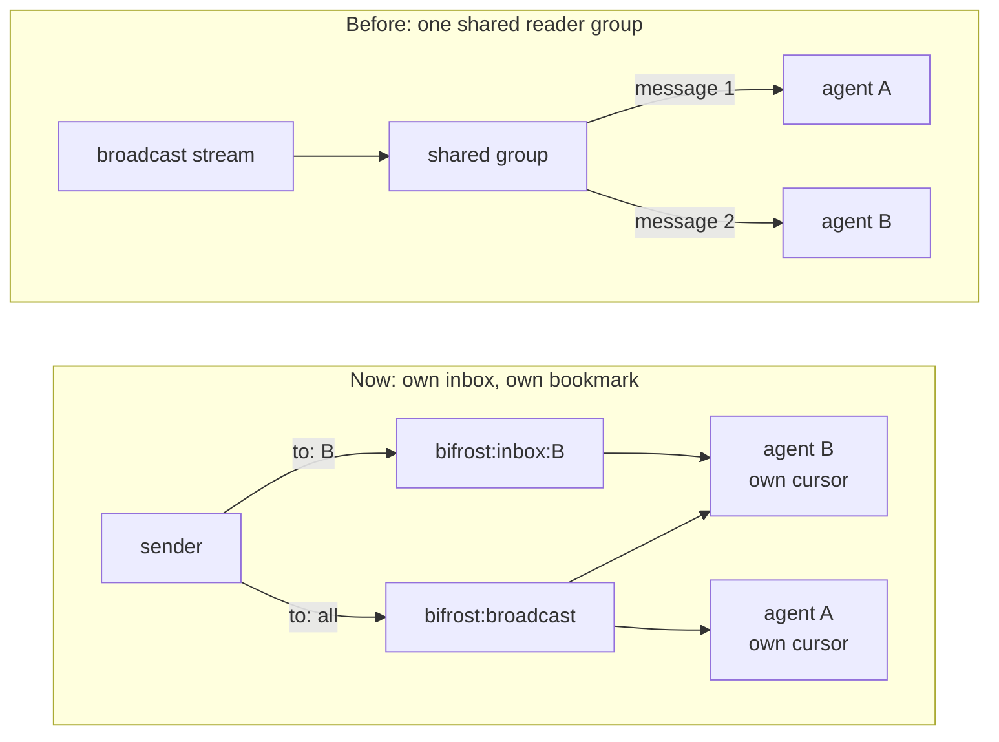

The bus is the mail system under Bifrost. A sender addresses a message to one agent, and the bus drops it into that agent's inbox. The mail waits there until the agent reads it. Each agent keeps a bookmark of how far it has read. Broadcasts go to one shared stream that every agent reads with its own bookmark. Picture pigeonholes in a mailroom, with a bookmark for each reader.

## Why it exists

The old message layer had a broken broadcast. All agents read through one shared reader group. Such a group splits messages between its readers instead of copying them. So a "broadcast" reached only one agent. The bus gives each agent its own inbox and its own bookmark. It also keeps live chatter out of the lasting [Ledger](/docs/concepts/foundations/ledger), on purpose.

## How it works



A shared group splits messages between its readers. Separate cursors give every reader every message.


- **Streams.** The bus runs on Redis Streams. Each agent reads `bifrost:inbox:<agent>`. Broadcasts go to `bifrost:broadcast`.
- **Bookmarks.** The code calls the bookmark a cursor. It holds the last message id the agent read. A read can peek, which leaves the cursor where it is. Or it can consume, which moves the cursor on.
- **At least once, for runners.** A [runner](/docs/concepts/bifrost/runners) moves its cursor only after it answers. If it crashes first, the message comes again. A plain consuming read moves the cursor as soon as you read.
- **Lanes.** The bus picks a lane from the message kind, and the sender cannot choose. Work mail rides `work`. Control signals such as pause and nudge ride `sig`, so they never wait behind chatter. Telemetry rides `trace`.
- **Caps.** Each stream keeps its newest 5,000 to 10,000 messages. Older mail falls off the end.
- **Size.** When you send a message over 64 KB, the bus splits it into pieces. The reader joins them back up. The bus never cuts a message short.
- **Spill.** Past 8,000 characters, `bifrost-send` and a runner's tools store the full text in a file. The message keeps the start, plus a `blob:<sha>` pointer you read with `bifrost-fetch`.
- **Kinds.** Each message has a kind, such as `chat`, `request`, `handoff`, `reply` or `question`. A `reply` marks the message it answers as handled.
- **Offline is loud.** If Redis is down, the bus reports itself offline. A send returns nothing, and no agent crashes.

The move to lanes is half done. For now each message also lands in the old inbox stream. So you may see one message twice, under two ids. The bus records that the two ids belong together.

## How you use it

```bash
aurora bifrost-sync <me>             # say you are here, peek at unread mail
aurora bifrost-sync <me> --consume   # read and move your cursor
aurora bifrost-send <me> --to deepseek --kind request "Where is the lock freed?"
```

Reading is not consuming. The `bifrost_inbox` tool of the [MCP door](/docs/concepts/coordination/doors) only peeks, unless you pass `consume=true`. Your [boot](/docs/concepts/memory/boot) peeks at your inbox too. See [Use the bus](/docs/how-to/use-the-bus) for a walk-through.

## Don't confuse it with

- **The Ledger** — it lasts, and every reader replays the same shared record. The bus drops mail into one agent's inbox, and later forgets it.
- **Bifrost** — the whole live layer. The bus is only the transport inside it.

## How it connects

- **Built on:** [Hybrid storage](/docs/concepts/foundations/hybrid-storage) (Redis)
- **Used by:** [Seats](/docs/concepts/bifrost/seats), [Wake](/docs/concepts/bifrost/wake), [Runners](/docs/concepts/bifrost/runners), [Promoter](/docs/concepts/bifrost/promoter), [Handoff](/docs/concepts/bifrost/handoff), [Control plane](/docs/concepts/bifrost/control-plane), [Liveness](/docs/concepts/bifrost/liveness), [Console](/docs/concepts/bifrost/console), [Bridge](/docs/concepts/bifrost/bridge)
- **Part of:** [Bifrost](/docs/concepts/bifrost)
