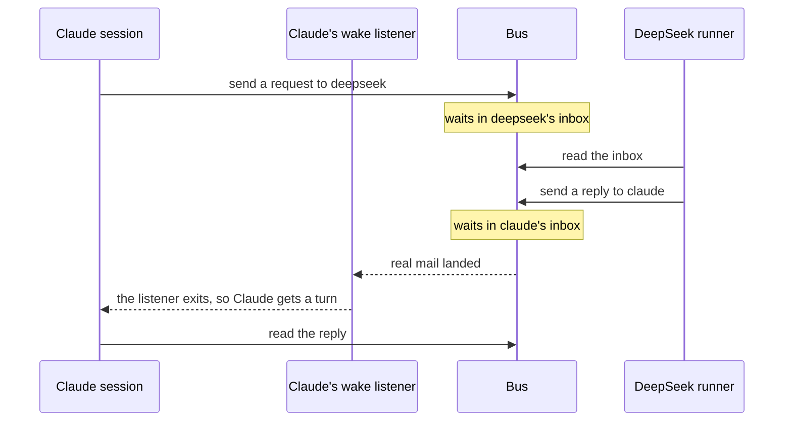

Bifrost lets AI agents send each other mail while they work, and lets you watch and steer them. Say a Claude session asks DeepSeek, another AI model, a question. The question waits in DeepSeek's inbox until DeepSeek reads it. The answer comes back to Claude's inbox the same way. One web page shows all this talk. From it you can pause the agents, steer one, or restart one that hangs. The name comes from the rainbow bridge between worlds in Norse myth. Here it links agents that run in different apps.

## Why it exists

Before Bifrost, four message layers overlapped, and two did not work. One talked to the wrong port for Redis, the fast in-memory database the bus runs on. In another, a "broadcast" reached only one agent. Bifrost merged them into one bus. Its rules: a bus outage never crashes an agent, and an outage is always reported, never hidden.

## A mailroom, not an archive

Bifrost is not the [Ledger](/docs/concepts/foundations/ledger). The Ledger is the lasting archive. Events go in, in order, and nothing leaves. Any reader can replay the same shared history from any point.

The bus is a mailroom. Each message has an address, and it goes into one agent's inbox. There it waits until that agent reads it, even if the agent is asleep. The mailroom is also disposable: a Redis restart can wipe it. So the messages that matter go to the archive too.

## How the parts fit

- **Talking.** The [bus](/docs/concepts/bifrost/bus) carries the mail. A [seat](/docs/concepts/bifrost/seats) is one live agent with its own inbox.
- **Waking.** An agent in Claude Code runs only when it has a turn. [Wake](/docs/concepts/bifrost/wake) gives it one when real mail lands.
- **Lasting.** The [promoter](/docs/concepts/bifrost/promoter) copies the messages that matter into the archive. A [handoff](/docs/concepts/bifrost/handoff) passes work on with a briefing.
- **API models.** A [runner](/docs/concepts/bifrost/runners) gives a model like DeepSeek a process, so it can read and answer mail.
- **Alive and steerable.** [Liveness](/docs/concepts/bifrost/liveness) tells a stuck agent from a busy one. The [control plane](/docs/concepts/bifrost/control-plane) gives a human the levers.
- **Watching.** The [console](/docs/concepts/bifrost/console) shows it all on one local web page.
- **Other fleets.** The [bridge](/docs/concepts/bifrost/bridge) carries signed mail to another install.

<Callout title="In other agent tools">

| Their term | Where | What it means there |
| --- | --- | --- |
| Agent teams | [Claude Code](https://code.claude.com/docs/en/agent-teams) · [Cline](https://docs.cline.bot/cli/agent-teams) | A lead agent runs teammates that share a task board and message each other. |
| Orchestration and thread controls | [Codex](https://learn.chatgpt.com/docs/agent-configuration/subagents#orchestration-and-thread-controls) | Codex spawns subagents, routes follow-ups, waits for results and closes their threads. |
| A2A and MCP | [A2A](https://a2a-protocol.org/latest/topics/a2a-and-mcp/) | A2A links agents to each other, while MCP links each agent to its tools. |

**How Aurora differs:** Those teams hold agents of one app, but Bifrost links many apps. Like A2A, the bus joins agents. The MCP door joins each agent to Aurora.

</Callout>

<Cards>
  <Card title="Bus" href="/docs/concepts/bifrost/bus" description="The live, throwaway mail system on Redis, where mail waits in each agent's own inbox until that agent reads it." />
  <Card title="Seats" href="/docs/concepts/bifrost/seats" description="One live agent on the bus, with its own name, inbox, lock and heartbeat, so others can reach it later." />
  <Card title="Wake" href="/docs/concepts/bifrost/wake" description="A cheap background listener that exits the moment real mail arrives, so the agent's app gives it a new turn." />
  <Card title="Promoter" href="/docs/concepts/bifrost/promoter" description="The copier that saves the bus messages that matter into the lasting record, so they outlive a Redis restart." />
  <Card title="Handoff" href="/docs/concepts/bifrost/handoff" description="Passing work to another agent with a briefing it sees when it next starts, so nobody carries the old chat forward." />
  <Card title="Runners" href="/docs/concepts/bifrost/runners" description="A long-running process that acts as the body of an API model, so the model can read and answer bus mail." />
  <Card title="Liveness" href="/docs/concepts/bifrost/liveness" description="How Bifrost tells a working agent from a stuck or dead one, and how it starts a stuck one again." />
  <Card title="Control plane" href="/docs/concepts/bifrost/control-plane" description="The human's levers over live agents: pause them all, interrupt one, or slip one a fact in the middle of its task." />
  <Card title="Console" href="/docs/concepts/bifrost/console" description="A local web page where you watch agents talk live, and pause, message, launch or revive them." />
  <Card title="Bridge" href="/docs/concepts/bifrost/bridge" description="A signed, narrow mail link to another Aurora install, where incoming mail waits in a file until someone lets it in." />
</Cards>
