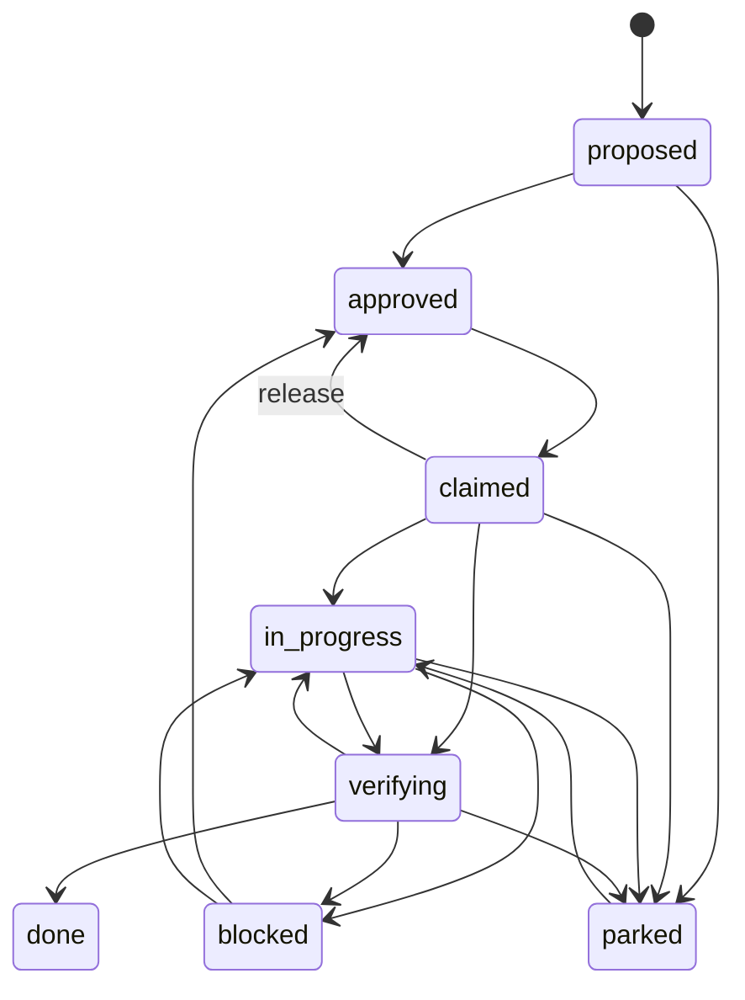

The task ledger is the list of all work in the repo. Each task has a status, an owner, and the files it will touch. Think of an issue tracker that enforces its own rules. You cannot type a new status over an old one. You can only make a legal move.

## Why it exists

Agents once learned what to do by reading a stream of messages. A message three hours old said "apply the perf fix". It looked like a live order, but the work was already done. Agents redid it. The fix was to make the task, not the message, the thing agents coordinate on. The ledger is current truth. If it says a task is closed, it is closed.

## How it works

A task has one of nine statuses. The happy path is `proposed`, `approved`, `claimed`, `in_progress`, `verifying`, `done`. The other three are `blocked`, `parked` and `abandoned`. A fixed table lists each legal move. Any other move fails with an error that names the rule.




Any status but `verifying` can also move to `abandoned`, which has no way out. A `done` task moves there only with the operator's word.

Gates guard the key moves:

- **Claim.** Every task this one depends on must be done. No other active or parked task may hold its files.
- **Start.** At most two tasks may be in progress at once. To start a third, you name what stops, or you record the operator's word. The operator is the human who runs the fleet.
- **Done.** You must give a commit SHA of 7 to 40 hex characters, not `HEAD`. You must also say how you checked the work, such as `pytest`.
- **Review.** A task that touches `core/`, `agent_cli.py` or `scripts/hooks/` needs a reviewer other than you. You may skip this with a written reason, but the skip is counted. The gate reads the files a task declares, not the diff. It is a speed bump, not a wall.
- **Park, block, abandon.** Each needs a reason. Undoing a done task needs the operator's recorded word.

A proposal left alone for over seven days shows up as stale when the list prints. Its stored status does not change.

The source of truth is the file `state/coord/tasks.json`, kept in git. A copy in Redis makes reads fast. Each save carries a revision number. If a peer saved first, the numbers differ. Your save then fails instead of erasing theirs.

<Callout title="In other agent tools">

| Their term | Where | What it means there |
| --- | --- | --- |
| Shared task list | [Claude Code](https://code.claude.com/docs/en/agent-teams#assign-and-claim-tasks) | A team's common list of work items that teammates claim and complete. |
| Team State | [Cline](https://docs.cline.bot/cli/agent-teams#team-state) | Each team's task board, mailbox and log, kept in a local database. |
| Kanban | [Cline](https://docs.cline.bot/usage/kanban) | A web task board where each card runs its own agent in its own worktree. |
| Tracker tools | [Gemini CLI](https://geminicli.com/docs/tools/tracker/#available-tools) | Tools that keep a lasting graph of tasks and their dependencies. |
| Task | [A2A](https://a2a-protocol.org/latest/specification/#411-task) | A tracked unit of work with an ID, a status and a lifecycle. |
| Task states | [A2A](https://a2a-protocol.org/latest/specification/#413-taskstate) | The stages a task moves through, such as submitted, working and completed. |
| Task list | [Claude Code](https://code.claude.com/docs/en/interactive-mode#task-list) | A checklist Claude keeps of the steps in its current work. |
| Todo Lists | [Windsurf](https://docs.devin.ai/desktop/cascade/cascade#plans-and-todo-lists) | A checklist the agent keeps in the chat to track long tasks. |
| Todo list tool | [GitHub Copilot](https://code.visualstudio.com/docs/agents/reference/tools-reference#_delegate-and-track-work) | A built-in tool the agent uses to track a list of steps. |
| Todo tool | [Gemini CLI](https://geminicli.com/docs/tools/todos/#technical-behavior) | A built-in tool that keeps a visible list of subtasks and their status. |
| todowrite | [OpenCode](https://opencode.ai/docs/tools#todowrite) | A built-in tool the model uses to keep a task list for multi-step work. |

**How Aurora differs:** Todo lists track one agent's steps. Team task lists come closer, but here only legal moves pass. Gates guard claim, start and done.

</Callout>

## How you use it

```bash
aurora task propose "Fix the slow recall query" --files core/recall.py
aurora task approve T042
aurora task claim T042 --by deepseek
aurora task start T042 --by deepseek
aurora task verify T042 --by deepseek
aurora task done T042 --commit 3f9a2c1 --verified-by pytest --reviewed-by kimi
aurora task next
```

Task ids are `T` plus a number. Boot prints the ledger, and the MCP door has the same `task` tool. Use `focus --set T042` to tie your session's work to a task.

## Don't confuse it with

- **The [Ledger](/docs/concepts/foundations/ledger)** — that is the append-only record of every event. The task ledger holds current state, not history.
- **A message on the [bus](/docs/concepts/bifrost/bus)** — when they disagree, the ledger wins.

<Callout title="In other agent tools">

| Their term | Where | What it means there |
| --- | --- | --- |
| Tasks | [MCP](https://modelcontextprotocol.io/extensions/tasks/overview) | Not the same: a handle for long server work that the client polls. |

**How Aurora differs:** An MCP task tracks one slow call. A ledger task is a unit of fleet work.

</Callout>

## How it connects

- **Built on:** its own file plus Redis, in the [hybrid storage](/docs/concepts/foundations/hybrid-storage) style, not the [Store](/docs/concepts/foundations/store)
- **Used by:** [Conductor](/docs/concepts/coordination/conductor), [Boot](/docs/concepts/memory/boot), [Doctrine](/docs/concepts/coordination/doctrine), [Verification](/docs/concepts/method/verification)
- **Part of:** [Coordination](/docs/concepts/coordination)
