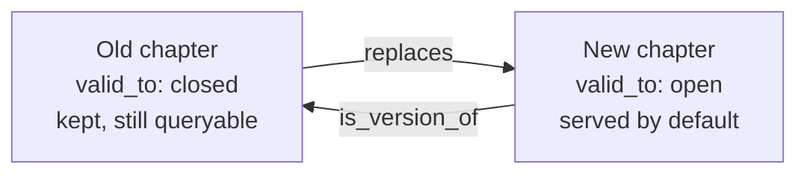

Aurora keeps its history as small records, and you only ever add to them. An event on the [Ledger](/docs/concepts/foundations/ledger) is one. A library document, called an atom, is another: each change adds a new version line. Nobody rewrites these records. To fix one, you add a new record that retires it. In the house phrase, corrections supersede.

Bookkeepers work this way. You never erase a line in the books. You post a correcting entry. You run reports again from the books.

The [Store](/docs/concepts/foundations/store) is different. It holds what IS, so its values change. Lessons live there, and a lesson can change in place.

## Why it exists

The rule began as tidiness: "nothing is ever rewritten, only superseded." Later it proved its worth. When a model summarizes a summary again and again, knowledge turns to mush. A summary built from the originals avoids that. The originals stay whole, so you can throw away a view and build it again.

<Callout title="In other agent tools">

| Their term | Where | What it means there |
| --- | --- | --- |
| /rewind | [Claude Code](https://code.claude.com/docs/en/checkpointing#rewind-and-summarize) · [Cursor](https://cursor.com/docs/cli/reference/slash-commands) | Jump back to an earlier message. Claude Code can also undo the code. |
| Restore Files / Restore Task Only / Restore Files & Task | [Cline](https://docs.cline.bot/core-workflows/checkpoints#restoring-checkpoints) | Three ways to roll back: undo file changes, undo chat messages, or both. |
| Edit & Restore | [Amp](https://ampcode.com/guides/context-management#edit-restore) | Edit an earlier message or restore the thread, which removes later turns. |
| Roll back recent turns | [Codex](https://learn.chatgpt.com/docs/app-server#roll-back-recent-turns) | An app-server call that removes the latest turns from a thread. |

**How Aurora differs:** These tools undo by dropping later turns. Aurora never drops a record. A fix is a new record, and the old one stays.

</Callout>

## How it works

- **Projections.** A projection is a view built from the records. You can delete it and build it again. The [library](/docs/concepts/memory/library) pages are projections of its atoms. Each page carries a "DO NOT EDIT" header and a hash, so drift shows.
- **Simple supersession.** The new record carries `supersedes: <old_id>`. The old one gets `superseded: True`. Reads skip retired records by default. Notes work this way.
- **Supersession with time.** Some records carry a `valid_to` time. Chapters of the [narrative spine](/docs/concepts/narrative/narrative-spine) are one example. Superseding closes the old record's `valid_to`. The old record gets a `replaces` link that points forward to the new one. The new one gets an `is_version_of` link back. The old record stays, and you can still query it.
- **Read forward.** Tools serve the newest record in a chain unless you ask for history.



Supersession with time adds a record and two links. It never deletes the old one.


<Callout title="In other agent tools">

| Their term | Where | What it means there |
| --- | --- | --- |
| Session tree and branches | [Pi](https://github.com/earendil-works/pi/blob/main/packages/coding-agent/docs/how-pi-works.md#sessions) | Going back to an earlier point starts a new branch and keeps the old path. |
| Context edit entry | [Pi](https://github.com/earendil-works/pi/blob/main/packages/coding-agent/docs/session-format.md#contexteditentry) | A new entry hides or replaces an old message for the model. The raw history keeps it. |
| Task immutability | [A2A](https://a2a-protocol.org/latest/topics/life-of-a-task/#task-immutability) | A finished task cannot restart, so a follow-up starts a new task. |

**How Aurora differs:** Same idea: add a new record and keep the old one. Aurora links the two with `replaces` and `is_version_of`. Reads serve the newest record unless you ask for history.

</Callout>

### How honest is "append-only"?

Nobody rewrites history. But three things do change in place.

First, simple supersession flips a flag on the old record. That flag lives in the Store, as current state.

Second, a Ledger stream can have a size cap. Past it, the oldest rows age out. A pointer can then outlive its event, and the event log says so: "payload aged out". Library atoms live in files that git tracks, so they keep every line.

Third, lessons are Store records. A new lesson with an existing name replaces the old one. Some tools also add fields to a lesson in place. The raw `learning` event on the Ledger keeps the main fields of each `learn`, while the stream's cap allows.

<Callout title="In other agent tools">

| Their term | Where | What it means there |
| --- | --- | --- |
| History persistence | [Codex](https://learn.chatgpt.com/docs/config-file/config-advanced#history-persistence) | A local transcript file. A size cap drops the oldest entries. |
| Session retention | [Gemini CLI](https://geminicli.com/docs/cli/session-management/#session-retention) | Settings that delete saved sessions after a set time, 30 days by default. |

**How Aurora differs:** Aurora caps some streams too, and the oldest rows age out. A pointer to a lost row says so. Library atoms live in git and keep every line.

</Callout>

## How you use it

```bash
aurora note <agent> --title "Deploy rule" --note "..."   # same title again retires the old note
aurora note <agent> --title "..." --note "..." --supersedes <id>
aurora notes --all                                       # retired notes carry a [SUPERSEDED ...] tag
```

## Don't confuse it with

- **Edit in place** — not allowed for an event or an atom.
- **Rebuild in place** — allowed for a projection. A derived record keeps its id and gets new content, because it is not a source.
- **`supersedes`** — a field name, not a [relationship type](/docs/concepts/foundations/relationship-types). The link is `replaces`.

## How it connects

- **Built on:** [Ledger](/docs/concepts/foundations/ledger), [Store](/docs/concepts/foundations/store), [Relationship types](/docs/concepts/foundations/relationship-types)
- **Used by:** [Library](/docs/concepts/memory/library), [Recall](/docs/concepts/memory/recall), [Narrative spine](/docs/concepts/narrative/narrative-spine), [Notes and agent memory](/docs/concepts/memory/notes-and-agent-memory), [Knowledge layers](/docs/concepts/foundations/knowledge-layers)
- **Part of:** [Foundations](/docs/concepts/foundations)
