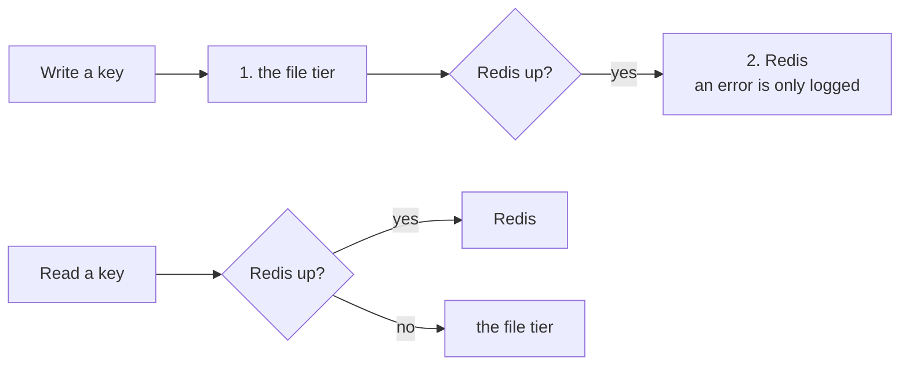

Under the [Store](/docs/concepts/foundations/store) and the [Ledger](/docs/concepts/foundations/ledger) sit swappable engines, called backends. Redis is fast but can be down. Files are slow but always there. The default backend, Hybrid, uses both. It writes to the file first, then to Redis if Redis answers.

Think of a notebook and a whiteboard. You always write in the notebook. If a whiteboard is in the room, you copy the note there too. To read, you look at the whiteboard if it is there. If not, you open the notebook.

<Callout type="warn" title="Known weak spot">The default file tier rewrites one JSON file on every change, so busy processes can lose writes. Once the file held 23 lessons while Redis held 540. A safer SQLite tier exists but is off by default.</Callout>

## Why it exists

The project once ran three Redis servers to stay up at all times. That turned out to be more than it needed. What mattered was getting data back after a crash, not uptime. One Redis with a file fallback did the job.

## How it works




- **Write:** the file first, then Redis. A Redis error goes to the log. It never stops the write.
- **Read:** Redis if it is up, else the file.
- **Compare-and-set:** Redis decides while it is up. Then the result goes to the file too.
- **Fast connect:** On Windows, a ping to a down Redis once hung for about 48 seconds. Now a half-second probe runs first. If Redis does not answer, the code goes on without it.
- **Repair at boot:** While Redis is down, writes reach only the file. When Redis comes back, it holds old data. If any key is missing from Redis, `boot` copies the file's keys into Redis. Plain keys, hash fields and sorted-set scores take the file's value. Sets gain the file's members.
- **Lists stay put:** Lists are the exception. The repair adds only the lists Redis lacks. A real incident set this rule. A file copy of 16 lessons once replaced a Redis list of 485. Recall lost most of its memory.
- **Embedded Redis:** A checkout with no Redis server gets one. The first time it looks, it records whether Redis answered. If not, the code starts a small stand-in on the checkout's own port. It saves to SQLite five times a second. Nobody starts it by hand, and clients cannot tell the difference.
- **SQLite tier:** Set `AKASHIC_STORE_BACKEND=sqlite` to swap the file tier for SQLite.

## How you use it

```bash
aurora boot <agent>                                        # prints [boot] and [heal] lines
uv run python -m core.foundation.embedded_redis --status   # is the stand-in running?
```

## Don't confuse it with

- **The old Redis pair** — two spare servers once kept beside the main one, for uptime. The project no longer uses them.
- **`durable_reconcile`** — a separate tool that a person runs before a move to SQLite. It can overwrite, but it keeps the old value aside. The boot repair keeps no copy of what it overwrites.
- **Embedded Redis and the bus** — embedded Redis is a stand-in server. It is not a second [bus](/docs/concepts/bifrost/bus).

<Callout title="In other agent tools">

| Their term | Where | What it means there |
| --- | --- | --- |
| Backend Modes | [Cline](https://docs.cline.bot/sdk/architecture/hub-spoke#backend-modes) | Not the same: settings that choose where the agent runs, through a hub or in process. |

**How Aurora differs:** In Aurora, a backend is a storage engine under the Store and the Ledger. It decides where data lives, not where the agent runs.

</Callout>

## How it connects

- **Built on:** Redis, plain files and SQLite; it applies the [fail soft](/docs/concepts/foundations/fail-soft) rule
- **Used by:** [Store](/docs/concepts/foundations/store), [Ledger](/docs/concepts/foundations/ledger), [Boot](/docs/concepts/memory/boot); the [Bus](/docs/concepts/bifrost/bus) uses its embedded Redis only
- **Part of:** [Foundations](/docs/concepts/foundations)
