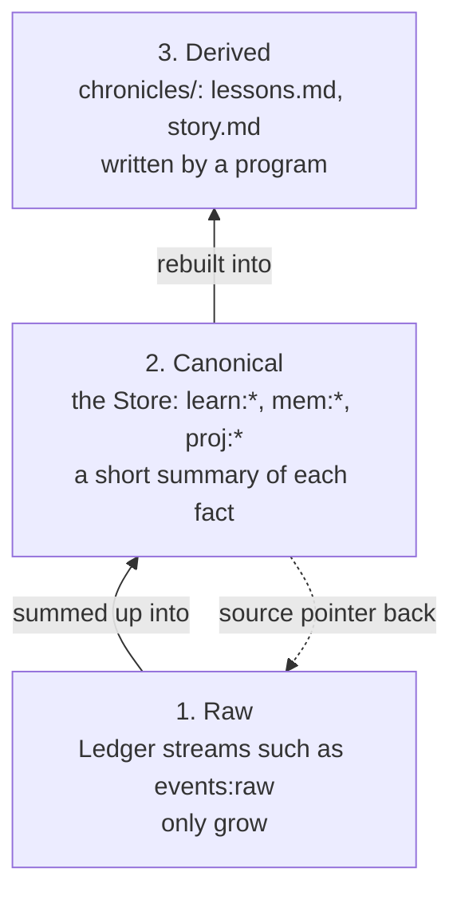

Aurora keeps what it knows at three depths. The raw layer holds everything, in order. The canonical layer holds a short, current summary of each fact, with a pointer back to the raw. The derived layer holds readable pages made from the summaries.

A court works like this. The transcript is raw. An index card sums up a point and cites a page of the transcript. The published digest comes from the cards.

## Why it exists

Once, the same knowledge lived in several places that disagreed. Redis held 12 experiments where the file held 18. Real lessons sat mixed with test junk. The richest copy of the best lessons was the one nobody served. A cleanup set one model and lost no history. Junk went to a holding file, not the bin. Tests moved to their own Redis database.

## How it works

1. **Raw.** [Ledger](/docs/concepts/foundations/ledger) streams such as `events:raw` and `agent:events`. They only grow, within each stream's size cap.
2. **Canonical.** The [Store](/docs/concepts/foundations/store), under keys such as `learn:*`, `mem:*` and `proj:*`. Each record is a short summary plus a `source` pointer to where it came from.
3. **Derived.** Files under `chronicles/`, such as `lessons.md` and `story.md`. A program writes them. Each says at the top: do not hand-edit.

The rule fits in four lines. Keep the raw intact. Let the Store sum up, with a pointer. Rebuild the chronicles from the Store. Never hand-edit a derived page as if it were a source.

Lessons are an exception. An agent writes a lesson straight into the Store, so the Store copy is the original. Its `source` names itself. When you run `learn`, the Store saves the lesson first. Then a story beat, one moment in the [narrative spine](/docs/concepts/narrative/narrative-spine), and a raw `learning` event both point to it.

An old file, `session_logs/learnings.jsonl`, once held raw lessons. Today it is a leftover. The Store reads it once at start and never writes it.

## How you use it

- `learn` writes layers one and two.
- `recall` reads layer two.
- `events --get event:<stream>:<id>` drills down to layer one.
- The files in `chronicles/` are layer three.

## Don't confuse it with

- **[Code floors](/docs/concepts/foundations/code-floors)** — the stack of code and who may import whom. Knowledge layers are copies of data.
- **[Chronicles](/docs/concepts/memory/chronicles)** — the word belongs to the derived layer. Do not call the raw log a chronicle.

## How it connects

- **Built on:** [Ledger](/docs/concepts/foundations/ledger), [Store](/docs/concepts/foundations/store), [Append-only record](/docs/concepts/foundations/append-only-record)
- **Used by:** [Recall](/docs/concepts/memory/recall), [Narrative spine](/docs/concepts/narrative/narrative-spine), [RENEW](/docs/concepts/narrative/renew), [Ranker and distiller](/docs/concepts/memory/ranker-and-distiller)
- **Part of:** [Foundations](/docs/concepts/foundations)
