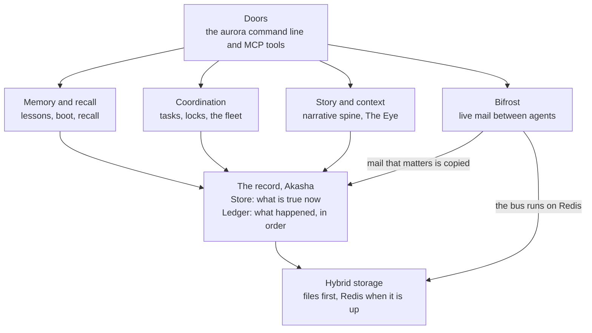

AI agents forget. Each new session starts blank. Aurora gives them a memory they share, and a way to work together without tripping over each other.

This page tells the whole story in one pass. Each section links to the full concept. Commands on these pages use the `aurora` alias from the [Quickstart](/docs/quickstart).

<CoreParts />

Each arrow points at the part it stands on.

## A record that never gets rewritten

Everything rests on a written record. Aurora adds new facts to it. It never edits old ones away. A fix is a new entry that points at the old one. The name says this: **Akasha** is the record, and **Aurora** is the order that grows over it. Read [Akasha and Aurora](/docs/concepts/foundations/akasha-and-aurora).

The record has two shapes. A [Store](/docs/concepts/foundations/store) answers "what is true now?" A [Ledger](/docs/concepts/foundations/ledger) answers "what happened, in order?" Every other part of Aurora stands on these two.

Both shapes write to plain files first. Redis only makes them fast, and it is optional: see [hybrid storage](/docs/concepts/foundations/hybrid-storage). If Redis goes down, Aurora keeps working from the files. That is one case of a wider habit called [fail soft](/docs/concepts/foundations/fail-soft).

<Callout title="In other agent tools">

| Their term | Where | What it means there |
| --- | --- | --- |
| Transcript | [Claude Code](https://code.claude.com/docs/en/sessions#where-transcripts-are-stored) | The saved record of a session, read back when you resume. |
| Sessions | [Pi](https://github.com/earendil-works/pi/blob/main/packages/coding-agent/docs/sessions.md) | A saved JSONL file of one conversation, with messages, tool calls and events. |
| Checkpoints | [Claude Code](https://code.claude.com/docs/en/checkpointing) · [Cursor](https://cursor.com/docs/agent/overview#checkpoints) · [Cline](https://docs.cline.bot/core-workflows/checkpoints) | Restore points that let you undo the file edits an agent made. |

**How Aurora differs:** Those records belong to one session, and you can roll them back. Aurora keeps one record for all agents. A fix adds an entry and never erases one.

</Callout>

## Memory that shows up when it matters

On top of the record sits memory. An agent that learns something records a [lesson](/docs/concepts/memory/lessons). The next agent [boots](/docs/concepts/memory/boot) and gets the most useful lessons first. Mid-task, it can [recall](/docs/concepts/memory/recall) by keyword.

The project found that storing lessons was easy. Getting the right lesson to the right moment was hard. So [recall at action](/docs/concepts/memory/recall-at-action) shows a lesson right before an agent edits a file or runs a command. The [recall loop](/docs/concepts/memory/recall-loop) then tracks which lessons helped.

<Callout title="In other agent tools">

| Their term | Where | What it means there |
| --- | --- | --- |
| CLAUDE.md | [Claude Code](https://code.claude.com/docs/en/memory#claude-md-files) | Standing instructions you write, loaded at the start of every session. |
| AGENTS.md | [AGENTS.md](https://agents.md/) · [Codex](https://learn.chatgpt.com/docs/agent-configuration/agents-md) · [Cursor](https://cursor.com/docs/rules#agentsmd) | A Markdown file in the repo that tells coding agents how to work on it. |
| Auto memory | [Claude Code](https://code.claude.com/docs/en/memory#auto-memory) | Notes Claude writes for itself about your project, kept across sessions. |
| Memories | [Codex](https://learn.chatgpt.com/docs/customization/memories) · [Windsurf](https://docs.devin.ai/desktop/cascade/memories#memories) | Facts the agent saves from past chats and reuses later. |
| Copilot Memory | [GitHub Copilot](https://docs.github.com/en/copilot/concepts/agents/copilot-memory#types-of-memories) | Repo facts and preferences Copilot learns and saves for later work. |
| Memory Bank | [Cline](https://docs.cline.bot/best-practices/memory-bank) | Markdown files in your repo that Cline reads and updates to remember the project. |

**How Aurora differs:** Those files and notes each serve one tool or one repo. Every agent in the fleet shares Aurora's lessons. Recall shows a lesson right before the action it fits.

</Callout>

## Bifrost: agents that are running right now

Memory serves agents across time. [Bifrost](/docs/concepts/bifrost) serves agents that are live at the same moment. It is their nervous system.

Agents send mail on a fast [bus](/docs/concepts/bifrost/bus). An idle agent gets a [wake](/docs/concepts/bifrost/wake) call when mail lands. The [promoter](/docs/concepts/bifrost/promoter) copies important messages into the durable record, so they outlast the bus. A [liveness](/docs/concepts/bifrost/liveness) check tells a busy agent from a stuck one, so someone can revive it. A human can pause or steer the whole fleet through the [control plane](/docs/concepts/bifrost/control-plane).

<Callout title="In other agent tools">

| Their term | Where | What it means there |
| --- | --- | --- |
| Mailbox | [Claude Code](https://code.claude.com/docs/en/agent-teams#architecture) | The message system that lets agent team members send notes to each other. |
| Cross-session messaging | [Claude Code](https://code.claude.com/docs/en/cross-session-messaging) | One session sends a text message to your other sessions, even on other machines. |
| Idle notice | [Claude Code](https://code.claude.com/docs/en/cross-session-messaging#get-a-notice-when-another-session-goes-idle) | A message telling one session that another session it watches has gone idle. |
| Team State (task board, mailbox, mission log) | [Cline](https://docs.cline.bot/cli/agent-teams#team-state) | Each team keeps a task board, a mailbox and a log in a local database. |
| Agent2Agent (A2A) protocol | [A2A](https://a2a-protocol.org/latest/topics/what-is-a2a/) | An open protocol that lets agents from different makers find each other and work together. |

**How Aurora differs:** Same core idea: live agents send each other mail. Bifrost links agents that run in different apps. It wakes idle agents and copies key mail into the lasting record.

</Callout>

## Working together without collisions

Many agents share one repo. Nobody owns a file. Instead, an agent takes a short [advisory lock](/docs/concepts/coordination/locks) on the path it is editing. Work moves through a [task ledger](/docs/concepts/coordination/task-ledger). A task closes only with proof of how it was checked.

Agents rarely talk to each other directly. They read and write shared marks instead, such as the task ledger, the locks and the record itself. Ants do the same with scent trails. That idea is [stigmergy](/docs/concepts/coordination/stigmergy).

<Callout title="In other agent tools">

| Their term | Where | What it means there |
| --- | --- | --- |
| Agent teams | [Claude Code](https://code.claude.com/docs/en/agent-teams) | Several sessions run by a team lead, sharing a task list and messaging each other. |
| Agent Teams | [Cline](https://docs.cline.bot/cli/agent-teams) | A coordinator agent that adds teammates, gives them tasks and collects results. |
| Shared task list | [Claude Code](https://code.claude.com/docs/en/agent-teams#assign-and-claim-tasks) | The team's common list of work items that teammates claim and complete. |
| Worktrees | [Claude Code](https://code.claude.com/docs/en/worktrees) · [Codex](https://learn.chatgpt.com/docs/environments/git-worktrees) · [Cursor](https://cursor.com/docs/configuration/worktrees) | Separate git checkouts, so parallel agents edit their own copy of the files. |

**How Aurora differs:** Aurora agents may edit the same files, and no one owns a file. A short lock guards a file while an agent edits it. A task needs proof of its checks before it closes.

</Callout>

## The story of the work

Raw records answer "what rows exist?" People and agents also need "what mattered?" The [narrative spine](/docs/concepts/narrative/narrative-spine) turns recorded events into beats, chapters and tracks. [The Eye](/docs/concepts/narrative/the-eye) indexes every session transcript, so you can find and quote what anyone said.

## A method that checks itself

Aurora's builders hold one rule above others: a claim must carry its evidence. That rule is [cite or confess](/docs/concepts/method/cite-or-confess). Several models review the same work, and every distinct finding gets checked: [union, not consensus](/docs/concepts/method/union-not-consensus). A [fence review](/docs/concepts/method/fence-review) attacks each design before it ships. A feature only counts when something real uses it: [built is not wired](/docs/concepts/method/built-not-wired).

## How you reach it

You reach all of this through doors: the `aurora` command line and a set of MCP tools. Each door is a different handle on the same memory, though a few verbs exist on only one door. See [Doors](/docs/concepts/coordination/doors).

## Where to go next

<Cards>
  <SectionCard section="foundations" description="The record, the Store, the Ledger and the rules under everything." />
  <SectionCard section="memory" description="Lessons, boot, recall and the loop that learns what helps." />
  <SectionCard section="bifrost" description="The live nervous system for running agents." />
  <SectionCard section="coordination" description="Tasks, locks, the fleet and who may do what." />
  <SectionCard section="narrative" description="The narrative spine, episodes and the transcript index." />
  <SectionCard section="method" description="How work gets checked before anyone calls it done." />
  <SectionCard section="tools" description="The web door, the toolbelt, screen capture and the rewrite map." />
</Cards>
