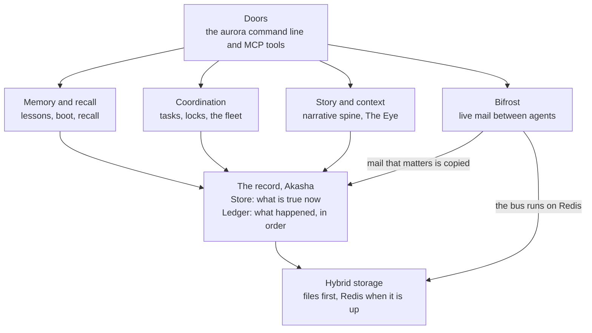

AI agents forget. Each new session starts blank. Aurora gives them a memory they share, and a way to work together without tripping over each other.

This page tells the whole story in one pass. Each section links to the full concept. Commands on these pages use the `aurora` alias from the [Quickstart](/docs/quickstart).

<CoreParts />

Each arrow points at the part it stands on.

## A record that never gets rewritten

Everything rests on a written record. Aurora adds new facts to it. It never edits old ones away. A fix is a new entry that points at the old one. The name says this: **Akasha** is the record, and **Aurora** is the order that grows over it. Read [Akasha and Aurora](/docs/concepts/foundations/akasha-and-aurora).

The record has two shapes. A [Store](/docs/concepts/foundations/store) answers "what is true now?" A [Ledger](/docs/concepts/foundations/ledger) answers "what happened, in order?" Every other part of Aurora stands on these two.

Both shapes write to plain files first. Redis only makes them fast, and it is optional: see [hybrid storage](/docs/concepts/foundations/hybrid-storage). If Redis goes down, Aurora keeps working from the files. That is one case of a wider habit called [fail soft](/docs/concepts/foundations/fail-soft).

## Memory that shows up when it matters

On top of the record sits memory. An agent that learns something records a [lesson](/docs/concepts/memory/lessons). The next agent [boots](/docs/concepts/memory/boot) and gets the most useful lessons first. Mid-task, it can [recall](/docs/concepts/memory/recall) by keyword.

The project found that storing lessons was easy. Getting the right lesson to the right moment was hard. So [recall at action](/docs/concepts/memory/recall-at-action) shows a lesson right before an agent edits a file or runs a command. The [recall loop](/docs/concepts/memory/recall-loop) then tracks which lessons helped.

## Bifrost: agents that are running right now

Memory serves agents across time. [Bifrost](/docs/concepts/bifrost) serves agents that are live at the same moment. It is their nervous system.

Agents send mail on a fast [bus](/docs/concepts/bifrost/bus). An idle agent gets a [wake](/docs/concepts/bifrost/wake) call when mail lands. The [promoter](/docs/concepts/bifrost/promoter) copies important messages into the durable record, so they outlast the bus. A [liveness](/docs/concepts/bifrost/liveness) check tells a busy agent from a stuck one, so someone can revive it. A human can pause or steer the whole fleet through the [control plane](/docs/concepts/bifrost/control-plane).

## Working together without collisions

Many agents share one repo. Nobody owns a file. Instead, an agent takes a short [advisory lock](/docs/concepts/coordination/locks) on the path it is editing. Work moves through a [task ledger](/docs/concepts/coordination/task-ledger). A task closes only with proof of how it was checked.

Agents rarely talk to each other directly. They read and write shared marks instead, such as the task ledger, the locks and the record itself. Ants do the same with scent trails. That idea is [stigmergy](/docs/concepts/coordination/stigmergy).

## The story of the work

Raw records answer "what rows exist?" People and agents also need "what mattered?" The [narrative spine](/docs/concepts/narrative/narrative-spine) turns recorded events into beats, chapters and tracks. [The Eye](/docs/concepts/narrative/the-eye) indexes every session transcript, so you can find and quote what anyone said.

## A method that checks itself

Aurora's builders hold one rule above others: a claim must carry its evidence. That rule is [cite or confess](/docs/concepts/method/cite-or-confess). Several models review the same work, and every distinct finding gets checked: [union, not consensus](/docs/concepts/method/union-not-consensus). A [fence review](/docs/concepts/method/fence-review) attacks each design before it ships. A feature only counts when something real uses it: [built is not wired](/docs/concepts/method/built-not-wired).

## How you reach it

You reach all of this through doors: the `aurora` command line and a set of MCP tools. Each door is a different handle on the same memory, though a few verbs exist on only one door. See [Doors](/docs/concepts/coordination/doors).

## Where to go next

<Cards>
  <SectionCard section="foundations" description="The record, the Store, the Ledger and the rules under everything." />
  <SectionCard section="memory" description="Lessons, boot, recall and the loop that learns what helps." />
  <SectionCard section="bifrost" description="The live nervous system for running agents." />
  <SectionCard section="coordination" description="Tasks, locks, the fleet and who may do what." />
  <SectionCard section="narrative" description="The narrative spine, episodes and the transcript index." />
  <SectionCard section="method" description="How work gets checked before anyone calls it done." />
  <SectionCard section="tools" description="The web door, the toolbelt, screen capture and the rewrite map." />
</Cards>
