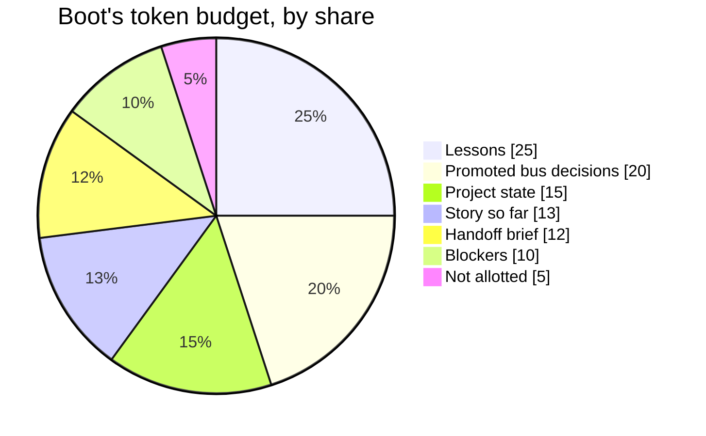

Boot is the first command an agent runs in a session. It prints a short briefing: where the work stands, which rules win, and the past lessons that fit the task. It works like a shift-change sheet. The top says where things stand. The lessons from past shifts come after.

## Why it exists

A fresh agent knows nothing. But dumping everything on it hurts too. More context can make an agent worse, not better. People call this context rot. So boot picks, ranks and trims. Real mistakes shaped the top of its output. Once, boot pointed a new session at a piece of work that was already done. Now boot skips finished work.

## How it works




Boot fills a budget of 9000 tokens by default. Each source gets a fixed share. Lessons get 25%. [Promoted](/docs/concepts/bifrost/promoter) bus decisions get 20%, and project state, such as progress and current work, gets 15%. The [story so far](/docs/concepts/narrative/narrative-spine) gets 13%, the [handoff](/docs/concepts/bifrost/handoff) brief 12%, and blockers 10%. The [distiller](/docs/concepts/memory/ranker-and-distiller) packs it all into short lines, each with a pointer to its source.

Boot scores each [lesson](/docs/concepts/memory/lessons) by how well it fits your task. Newer lessons get a small boost. Lessons that helped before score higher, through the [recall loop](/docs/concepts/memory/recall-loop). Graduated lessons, whose rules automation now enforces, stay out.

The head of the output comes first. It names the governing [arc](/docs/concepts/coordination/doctrine): the long piece of work your task belongs to. It points to the code map in `docs/ARCHITECTURE.md` and to the [working method](/docs/concepts/coordination/doctrine), the house rules for how to work. It shows the `where-we-are` [note](/docs/concepts/memory/notes-and-agent-memory) and the current directive, a note that says what to do first. It shows the next steps from the [task ledger](/docs/concepts/coordination/task-ledger). It states the rule of precedence. The task ledger beats durable notes. Notes beat promoted bus messages. Those beat the live bus. It lists the first six [live constraints](/docs/concepts/coordination/doctrine), the rules that hold right now. Last, it lists any core source that failed to load.

Then come the sections: lessons, the code that fits your task, blockers, notes and decisions. Last come your inbox, a one-line funnel report from the recall loop, and what changed since your last boot.

Each section fails open. If a source breaks, its section drops out and boot carries on. A few core sources, such as the notes store and the task ledger, also show up in that list of failures. This follows [fail-soft](/docs/concepts/foundations/fail-soft).

Boot also warms the cache for [recall at action](/docs/concepts/memory/recall-at-action).

You can install a session-start hook for Claude Code at the user level. It runs a light boot for you and injects a short primer. Inside such a session, a full boot skips the parts the primer covers: the funnel, the draft, the mail and the delta. Set `AKASHIC_BOOT_FULL=1` to get them all.

## How you use it

```bash
aurora boot <agent_id> --task "fix the flaky port test"
aurora delta <agent_id>
```

`delta` shows only what changed since your last boot. Agents that use tools call `knowledge_boot`.

## Don't confuse it with

- **[Recall](/docs/concepts/memory/recall)** — a search you run when you want it. Boot runs once, at the start.
- **The session-start primer** — the short text a hook injects. Boot is the full briefing.
- **[RENEW](/docs/concepts/narrative/renew)** — keeps a long session's context fresh. Boot loads context at the start.

## How it connects

- **Built on:** [Lessons](/docs/concepts/memory/lessons), [Notes](/docs/concepts/memory/notes-and-agent-memory), [Recall loop](/docs/concepts/memory/recall-loop), [Task ledger](/docs/concepts/coordination/task-ledger), [Handoff](/docs/concepts/bifrost/handoff), [Promoter](/docs/concepts/bifrost/promoter), [Narrative spine](/docs/concepts/narrative/narrative-spine)
- **Packed by:** [Ranker and distiller](/docs/concepts/memory/ranker-and-distiller)
- **Used by:** every agent session, [Recall at action](/docs/concepts/memory/recall-at-action), [RENEW](/docs/concepts/narrative/renew)
- **Part of:** [Memory and recall](/docs/concepts/memory)
