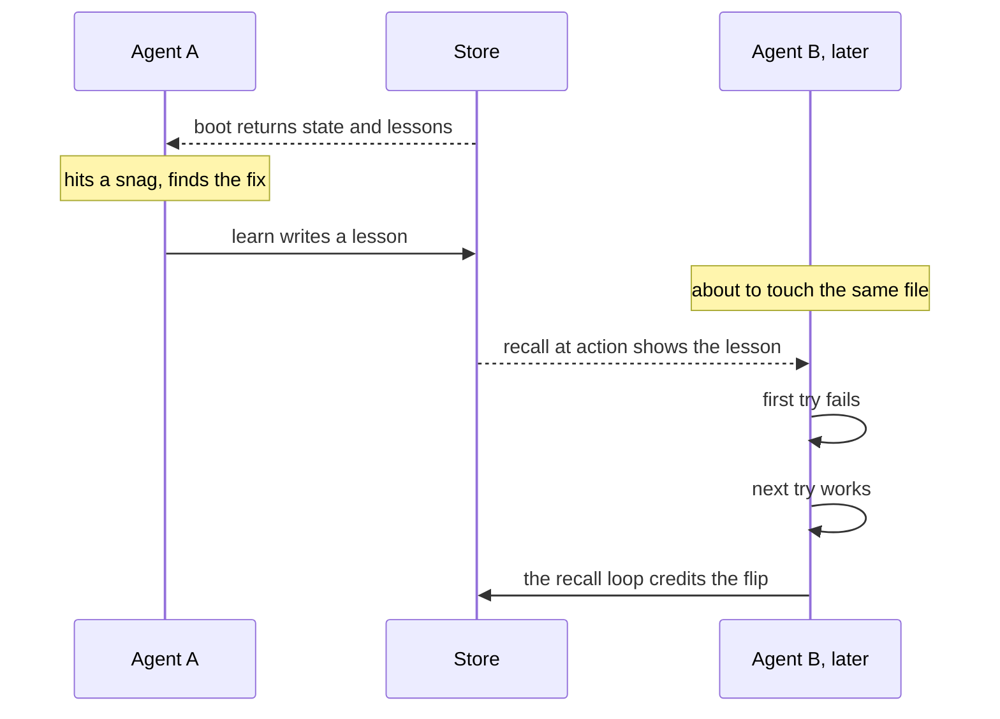

Every agent starts a session knowing nothing. This section is about one loop that fixes that.

An agent runs [boot](/docs/concepts/memory/boot). Boot prints where things stand and the past lessons most likely to matter. The agent gets to work and hits a snag. It finds the fix and runs `learn` to write a [lesson](/docs/concepts/memory/lessons). Later, a new agent is about to touch the same file. Before its first try runs, [recall at action](/docs/concepts/memory/recall-at-action) shows that lesson. Recall at action fires before every matching edit or command, not only after a failure. Say the first try still fails, and the next try works. The [recall loop](/docs/concepts/memory/recall-loop) credits the lesson for that flip, from fail to success. Lessons that help rise. A curator can bench lessons that never help. At any time, an agent can also [recall](/docs/concepts/memory/recall) by keyword.

Recall at action needs a hook, and you turn it on one project at a time. See [Recall at action](/docs/concepts/memory/recall-at-action).

Here is what the project learned. Storage was never the problem. Lessons piled up fast. The hard part was getting the right lesson to the moment of use. Most of this section serves that one goal.

<Callout title="In other agent tools">

| Their term | Where | What it means there |
| --- | --- | --- |
| Auto memory | [Claude Code](https://code.claude.com/docs/en/memory#auto-memory) | Notes Claude writes for itself about your project and preferences, kept across sessions. |
| Memories | [Codex](https://learn.chatgpt.com/docs/customization/memories) · [Windsurf](https://docs.devin.ai/desktop/cascade/memories#memories) | Notes or facts the agent saves from past chats and reuses in later sessions. |
| Copilot Memory | [GitHub Copilot](https://docs.github.com/en/copilot/concepts/agents/copilot-memory#types-of-memories) | Facts about a repository and your preferences that Copilot learns and reuses later. |

**How Aurora differs:** Most of these keep memory for one user or one agent. Every agent on the project shares Aurora's lessons. Aurora pushes a lesson right before the edit or command it fits.

</Callout>

The rest supports the loop. The [ranker and distiller](/docs/concepts/memory/ranker-and-distiller) pick what matters and pack it small. That page also covers [embeddings](/docs/concepts/memory/ranker-and-distiller), which match text by meaning. [Notes](/docs/concepts/memory/notes-and-agent-memory) hold project state. [Chronicles](/docs/concepts/memory/chronicles) are digests made from the records. The [library](/docs/concepts/memory/library) files the house docs. The [manuals shelf](/docs/concepts/tools/manuals-shelf) and [discover](/docs/concepts/tools/discover) now live under House tools.

## Where memory lives

- **Lessons** live under `learn:experiment:<name>` keys. **Notes** live under `mem:` keys.
- Both go through the [store](/docs/concepts/foundations/store). It keeps a copy in Redis and a copy in files. See [Hybrid storage](/docs/concepts/foundations/hybrid-storage).
- Tests and sandboxes stay apart from the real memory. `AI_SETUP` moves the files to another folder. `REDIS_DB=15` moves the Redis copy. See [Try it in a sandbox](/docs/how-to/try-it-in-a-sandbox).
- Lessons have no delete. You overwrite, graduate or bench them. Notes end with `note --retire`.

<Cards>
  <Card title="Lessons" href="/docs/concepts/memory/lessons" description="A short, durable record of what an agent tried, what happened, and what the next agent should do." />
  <Card title="Notes and AgentMemory" href="/docs/concepts/memory/notes-and-agent-memory" description="A note is a titled record of project state or a decision, fixed by writing a newer note with the same title." />
  <Card title="Boot" href="/docs/concepts/memory/boot" description="The start-of-session command that prints what an agent needs first: where things stand, the rules, and the lessons that fit its task." />
  <Card title="Recall" href="/docs/concepts/memory/recall" description="The keyword search you run over every stored lesson. Strong matches come first; with none, you get at most five weak hits." />
  <Card title="Recall at action" href="/docs/concepts/memory/recall-at-action" description="Lessons pushed to an agent right before it edits a file or runs a command, at most three, or none at all." />
  <Card title="Recall loop" href="/docs/concepts/memory/recall-loop" description="The feedback cycle that counts when a lesson shows up and when it helps, then lifts proven lessons and benches idle ones." />
  <Card title="Ranker and distiller" href="/docs/concepts/memory/ranker-and-distiller" description="The ranker scores items with a formula that shows its work; the distiller packs the best into a short text that points to its sources." />
  <Card title="Chronicles" href="/docs/concepts/memory/chronicles" description="Digest files made from the raw stores, which you read but never edit by hand." />
  <Card title="Library" href="/docs/concepts/memory/library" description="The home for the project's own documents, where each is a versioned record and the markdown you read is printed from it." />
</Cards>
