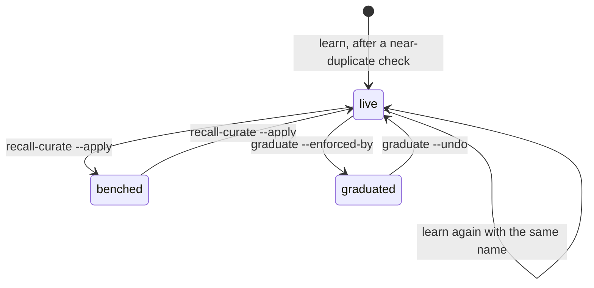

A lesson is one short record. It says what an agent tried, what happened, and what to do next time. It lives under a short name. Think of a card pinned to the workbench: "If you see X, do Y. Last time Z broke." Write a card with the same name, and it replaces the old one.

<Callout type="warn" title="Writing a name again replaces every field">A re-record is not a merge. Any field you leave out comes back empty. The category resets to `uncategorized` and the confidence to `medium`. The timestamp resets too, so the lesson counts as new again. Only the stamps survive: graduated, benched and related. Resend every field you want to keep.</Callout>

## Why it exists

Agents start every session knowing nothing. Without a shared store, each one repeats the last one's mistakes. Lessons began as lines in one flat file. They moved onto the [store](/docs/concepts/foundations/store), so they survive when Redis is down. Real failures shaped the rest. Once, recall could not see 446 of 464 lessons. The list that recall searched had drifted away from the lessons themselves. Now the store rebuilds that list from the lessons.

## How it works



- **Where it lives.** Each lesson is one record under the key `learn:experiment:<name>`. The store keeps it in Redis and in a file copy, `session_logs/store_state.json` under the data folder. See [Hybrid storage](/docs/concepts/foundations/hybrid-storage).
- **The name is the key.** You pass it with `--experiment`. The flag name is a leftover; the thing is a lesson. Writing the same name again overwrites the record in place, so you get no duplicates. The old text is gone from the record. The raw `learning` event still holds the old "tried" and "result" text, until the event log's cap pushes it out.
- **No delete.** No command removes a lesson. To fix a bad one, overwrite it. To retire one, graduate it.
- **The fields.** A lesson holds what you tried, what happened, and a recommendation. It can also hold what you expected, a category, a root cause, an anti-pattern and the files it touched. To write one, you need `--experiment` and at least one of `--tried` or `--result`.
- **Success is `yes`, `partial` or `no`.** It means: did the thing you tried work? The store scores them 100, 50 and 0. Common synonyms map over: `true`, `pass` and `ok` become `yes`, and `failed` and `error` become `no`. A word it does not know becomes `no`, so an unclear word never counts as a win. The `[OK]` line echoes the word you typed, not the stored value.
- **Set `--success` every time.** If you leave it out, the lesson counts as `yes`. The runner tool `knowledge_learn` has no success or category field, so its lessons are always stored as `yes`.
- **Categories are free text.** By habit, a human correction gets `--category correction`. Three things read the category. Boot ranks a category that starts with `constraint` above most others. Boot also lifts a lesson whose category words appear in your task. And the near-duplicate check uses it, as part of its "kind" point.
- **The recommendation starts with its trigger:** "Use when the symptom shows, before the action: the advice. Don't when the exception holds." [Recall at action](/docs/concepts/memory/recall-at-action) weighs the "Use when" part above the rest.
- **Near-duplicate warning.** Before it writes a new lesson, the store compares it to every old one. It checks five points: problem, root cause, fix, references and kind. It uses word overlap, not a model. At four or five matches, it tells you to update the old lesson instead. At two or three, it names a related lesson. It warns, but it never blocks the write. It skips the check when the name already exists, since that write is an update.
- **Two stamps.** The `graduated` stamp means automation now enforces the rule. Boot and recall at action stop showing it. The `benched` stamp means the [recall loop](/docs/concepts/memory/recall-loop) found the lesson never helped. Recall at action stops showing it, except for a rare second chance. Boot does not read this stamp. But the low credit that got the lesson benched also ranks it lower in boot. Stamps change only when someone runs a command. The `recall-curate --apply` command benches and unbenches. The `graduate` command graduates. Neither stamp deletes anything.
- **Repeats.** The flag `learn --repeat-of <name>` records that someone broke an existing lesson again. The flag `--recall-outcome` says what recall did at that moment.

## How you use it

```bash
aurora learn <agent_id> --experiment port-clash \
  --tried "started the dev server twice" --result "second start hung" \
  --recommend "Use when a server start hangs, before you retry: check the port. Don't when..." \
  --success partial
aurora graduate <agent_id> --experiment port-clash --enforced-by "port check in the start script"
```

API models on a [runner](/docs/concepts/bifrost/runners) use the `knowledge_learn` tool, which needs the `kb.learn` capability. See [Record a lesson](/docs/how-to/record-a-lesson) for the full steps.

## Don't confuse it with

- **Note** — a titled statement of project state. [Boot](/docs/concepts/memory/boot) shows notes, but recall does not rank them. See [Notes](/docs/concepts/memory/notes-and-agent-memory).
- **A `learning` signal** — an event on the [signal log](/docs/concepts/foundations/signals), not the stored lesson.
- **"Learning" and "experiment"** — the code says `LearningStore` and the key field says `experiment`. Both mean a lesson.

## How it connects

- **Built on:** [Store](/docs/concepts/foundations/store), [Hybrid storage](/docs/concepts/foundations/hybrid-storage)
- **Used by:** [Boot](/docs/concepts/memory/boot), [Recall](/docs/concepts/memory/recall), [Recall at action](/docs/concepts/memory/recall-at-action), [Recall loop](/docs/concepts/memory/recall-loop), [Narrative spine](/docs/concepts/narrative/narrative-spine)
- **Part of:** [Memory and recall](/docs/concepts/memory)
