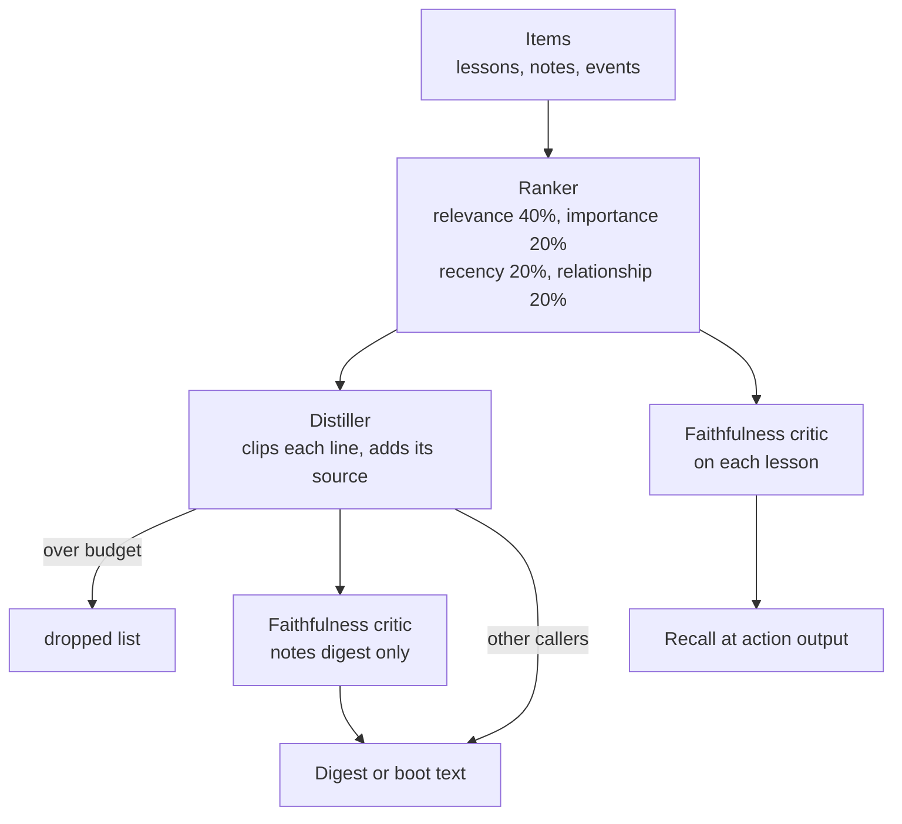

Many parts of Aurora ask the same question: what matters most here? The ranker answers it. It gives each item a score, and you can see how it got that score. Some callers then pass the top items to the distiller, which packs them into a short text. Every line keeps a pointer back to its source. A third part, the faithfulness critic, checks lines for a missing pointer or a made-up number.

## Why it exists

[Boot](/docs/concepts/memory/boot), [recall at action](/docs/concepts/memory/recall-at-action) and the digest writers all need a ranking. One shared scorer that shows its work beats three hidden ones. The distiller follows one rule: a lossy summary plus a lossless pointer. The text gets small, but you lose nothing. The full detail is always one hop away.

## How it works




The diagram shows two paths. On the first, the distiller packs the ranked items. Only the notes digest, `chronicles/memory.md`, runs the critic on that path. The story chronicler and boot's context builder use the distiller with no critic. On the second path, recall at action skips the distiller. It ranks lessons, runs the critic on each one, then prints them.

### The ranker

Think of a scorecard with four columns. Each column adds points:

- **Relevance**, 40%: how well the item's words match the question.
- **Importance**, 20%: how much the item matters. For a lesson in recall at action, "worked" gives 0.8 and anything else gives 0.6.
- **Recency**, 20%: newer counts more. The score fades with age, to about 37% at 14 days. The code calls the setting a half-life, but the score falls to 37%, not half, in that time.
- **Relationship**, 20%: the kind of [link](/docs/concepts/foundations/relationship-types) the item carries. It stays at a neutral 0.5 unless a caller sets weights.

By default, relevance is plain word overlap. A caller can swap in its own relevance function. Recall at action uses one that favors a lesson's "Use when" clause. The ranker returns each part of the score, so a caller can gate on one part. Recall at action gates on relevance alone.

Here is one worked score. Take a lesson that worked, is 14 days old and matches half the query:

| Part | Value | Weight | Points |
| --- | --- | --- | --- |
| Relevance | 0.5 | 0.4 | 0.20 |
| Importance | 0.8 | 0.2 | 0.16 |
| Recency | 0.37 | 0.2 | 0.07 |
| Relationship | 0.5 | 0.2 | 0.10 |
| **Sum** | | | **0.53** |

Recall at action then multiplies the sum by the lesson's usefulness factor. Say the lesson showed once and helped once. Its factor is about 1.17, so the final score is about 0.62.

The ranker skips any item that a newer record has [superseded](/docs/concepts/foundations/append-only-record). It honors both a `superseded` flag and a closed `valid_to` date. Lessons in recall at action carry neither field, so supersession never applies there.

### The distiller

The distiller takes the ranked list and a token budget. For each item, it picks the first useful field, such as the recommendation, and clips it. Each line ends with its source:

```text
- Check the port before you retry a hung start  (source: learn:experiment:port-clash)
```

It skips any item with no source, since no one could trace it. Items that do not fit the budget go on a dropped list, so you can still find them. Today the distiller only cuts and copies. It does not use a model.

### The faithfulness critic

The critic is a fact checker with two questions. Where did this line come from? Is that number in the source? Each line's pointer must lead to a real input. No number may appear that its source lacks. Word overlap is only a soft signal; it lowers confidence but never fails a line. The critic uses rules, not a model. A model as judge was too biased. On today's copy-only writer, it almost always passes. It still catches structural slips, such as a line with no pointer. It also stands guard for a future writer that might invent things.

### Embeddings: the meaning slot

Embeddings are an optional model that matches text by meaning. It turns text into numbers, so similar ideas land close together. They help when the words differ. Apple's guide says "hit target", not "tappable button size".

- **The model.** It is all-MiniLM-L6-v2. It runs on the CPU, offline. If it fails to load, callers fall back to keywords.
- **The install.** The `ml` dependency group installs sentence-transformers and PyTorch, several gigabytes. It does not fetch the model. The loaders force offline mode, so the model must already sit in your local Hugging Face cache. No repo script downloads it. Fetch it once with offline mode off, as the block below shows.
- **Off in two ways.** The library sits in an optional group. Story themes by embedding also need `AKASHIC_EMBED_THEMES=1`.
- **Who uses it.** The [manuals shelf](/docs/concepts/tools/manuals-shelf) uses it for search by meaning. The story theme finder uses it when you set `AKASHIC_EMBED_THEMES=1`.
- **The ranker's slot.** Relevance is the slot where a meaning score could go. Callers that set their own relevance function use word-based scoring. No live caller uses embeddings for ranking.

```bash
uv sync --group ml
HF_HUB_OFFLINE=0 uv run --group ml python -c "from sentence_transformers import SentenceTransformer; SentenceTransformer('sentence-transformers/all-MiniLM-L6-v2')"
```

Plain methods stay the default. In one test, embeddings lost to a keyword rule at sorting story events into threads. The keyword rule scored 0.754 on a standard match score, against 0.212 for embeddings. Better tools still have to beat the boring baseline on your own data. See [decision 0006](/docs/reference/decisions/0006-deterministic-by-default).

## Don't confuse it with

- **[Perspectives](/docs/concepts/narrative/perspectives)** — a lens sets the ranker's weights. The ranker does the scoring.
- **Embeddings** — a meaning-based score that could fill the ranker's relevance slot. No live caller fills it. Recall and recall at action use word matching.
- **`discover --semantic`** — a call to a language model. It does not use embeddings. See [Discover](/docs/concepts/tools/discover).

## How it connects

- **Built on:** [Append-only record](/docs/concepts/foundations/append-only-record) (supersession)
- **Used by:** [Boot](/docs/concepts/memory/boot), [Recall at action](/docs/concepts/memory/recall-at-action), [Chronicles](/docs/concepts/memory/chronicles), [Narrative spine](/docs/concepts/narrative/narrative-spine). [Perspectives](/docs/concepts/narrative/perspectives) is built, not wired. The [manuals shelf](/docs/concepts/tools/manuals-shelf) uses embeddings. Lookback, the knowledge map and event queries rank with it too; see the [commands reference](/docs/reference/commands).
- **Part of:** [Memory and recall](/docs/concepts/memory); it is the engine of the derived layer in [Knowledge layers](/docs/concepts/foundations/knowledge-layers)
