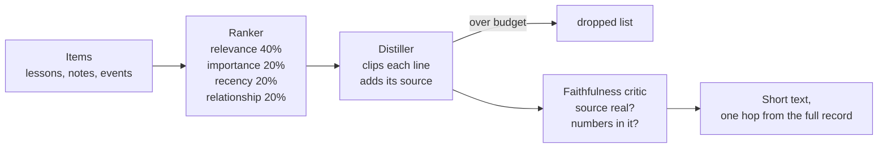

Many parts of Aurora ask the same question: what matters most here? The ranker answers it. It gives each item a score, and you can see how it got that score. The distiller then packs the top items into a short text. Every line keeps a pointer back to its source. A third part, the faithfulness critic, checks that the text invents nothing.

## Why it exists

[Boot](/docs/concepts/memory/boot), [recall at action](/docs/concepts/memory/recall-at-action) and the digest writers all need a ranking. One shared scorer that shows its work beats three hidden ones. The distiller follows one rule: a lossy summary plus a lossless pointer. The text gets small, but you lose nothing. The full detail is always one hop away.

## How it works




### The ranker

Think of a scorecard with four columns. Each column adds points:

- **Relevance**, 40%: how well the item's words match the question.
- **Importance**, 20%: how much the item matters, such as a lesson's outcome.
- **Recency**, 20%: newer counts more. The score fades with age, to about a third at 14 days.
- **Relationship**, 20%: the kind of [link](/docs/concepts/foundations/relationship-types) the item carries. It stays neutral unless a caller sets weights.

By default, relevance is plain word overlap. A caller can swap in its own relevance function. Recall at action uses one that favors a lesson's "Use when" clause. The ranker skips any item that a newer record has [superseded](/docs/concepts/foundations/append-only-record). It returns each part of the score, so a caller can gate on one part. Recall at action gates on relevance alone.

### The distiller

The distiller takes the ranked list and a token budget. For each item, it picks the first useful field, such as the recommendation, and clips it. Each line ends with its source:

```text
- Check the port before you retry a hung start  (source: learn:experiment:port-clash)
```

It skips any item with no source, since no one could trace it. Items that do not fit the budget go on a dropped list, so you can still find them. Today the distiller only cuts and copies. It does not use a model.

### The faithfulness critic

The critic is a fact checker with two questions. Where did this line come from? Is that number in the source? Each line's pointer must lead to a real input. No number may appear that its source lacks. Word overlap is only a soft signal; it lowers confidence but never fails a line. The critic uses rules, not a model. A model as judge was too biased. On today's copy-only writer, it passes every time. It stands guard for a future writer that might invent things.

## Don't confuse it with

- **[Perspectives](/docs/concepts/narrative/perspectives)** — a lens sets the ranker's weights. The ranker does the scoring.
- **Embeddings** — the ranker has a slot for a score based on meaning. No live caller fills it. See [Discover and embeddings](/docs/concepts/memory/discover-and-embeddings).

## How it connects

- **Built on:** [Append-only record](/docs/concepts/foundations/append-only-record) (supersession)
- **Used by:** [Boot](/docs/concepts/memory/boot), [Recall at action](/docs/concepts/memory/recall-at-action), [Chronicles](/docs/concepts/memory/chronicles), [Narrative spine](/docs/concepts/narrative/narrative-spine), [Perspectives](/docs/concepts/narrative/perspectives) (built, not wired)
- **Part of:** [Memory and recall](/docs/concepts/memory); it is the engine of the derived layer in [Knowledge layers](/docs/concepts/foundations/knowledge-layers)
