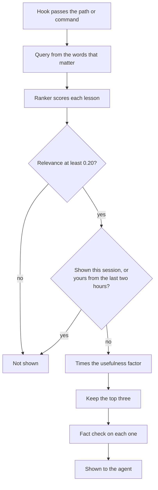

Recall at action brings lessons to you at the moment you act. Right before you edit a file or run a command, it looks for lessons that fit. It shows at most three. If none fits well, it shows nothing. Think of a colleague who speaks up as you reach for the tool, but only when they have something on point.

## Why it exists

Lessons sat in storage. Agents seldom read them at the moment they mattered. [Boot](/docs/concepts/memory/boot) shows lessons at the start, which is often far from the moment of use. So a hook now puts lessons in front of the agent at the point of action. A later rework added three things. It made matching favor each lesson's trigger. It added a floor below which recall stays silent. And it stopped echoing an agent's own fresh lessons back to it.

## How it works




- **The hook.** Before you edit a file or run a shell command in the repo, a hook passes the path or the command. Recall builds a query from the words that carry meaning. You install the hook for Claude Code at the user level, so check that yours has it.
- **The score.** The [ranker](/docs/concepts/memory/ranker-and-distiller) scores each [lesson](/docs/concepts/memory/lessons). Words in the "Use when" clause count most. There are no embeddings on this path.
- **The floor.** A lesson's relevance must pass 0.20, set by `AKASHIC_RECALL_FLOOR`. That value kept 95% of past helpful hits. Recall never pads the list to fill it.
- **The cap.** It shows three lessons at most.
- **No repeats.** A lesson shown once this session will not show again. A lesson you wrote in the last two hours stays hidden from you.
- **A fact check per item.** The [faithfulness critic](/docs/concepts/memory/ranker-and-distiller), a rule-based fact checker, checks each lesson on its own. A bad item drops, and its neighbors stay.
- **Usefulness.** Lessons that helped before score up to 1.5 times higher. Lessons that never help score as low as half. The [recall loop](/docs/concepts/memory/recall-loop) keeps those counts.
- **Extras.** It may add a note if another agent holds a lock on the file. It may also name up to two commands that fit the task. A slot exists for a line that disputes the top lesson, but it is not wired yet.
- **Speed.** Lessons come from a disk cache that lives two minutes. Boot warms it. If the store is down, the old cache still serves.

The hook fails open: if anything breaks, your tool call goes ahead. Set `AKASHIC_RECALL_AT_ACTION=0` to turn it off.

## How you use it

Once you install the hook, it runs on its own. You can also call it by hand:

```bash
aurora recall-at --path core/comm/bus.py
aurora recall-at --command "pytest tests/test_bus.py" --limit 3
```

## Don't confuse it with

- **[Recall](/docs/concepts/memory/recall)** — a search you pull. Recall at action pushes lessons to you.
- **Boot's lesson list** — shown once, at the start, within a budget.
- **The peer lock** — the same hook denies an edit to a file another agent [holds a lock on](/docs/concepts/coordination/locks). Recall at action only reports the lock. The hook enforces it.

## How it connects

- **Built on:** [Lessons](/docs/concepts/memory/lessons), [Ranker and distiller](/docs/concepts/memory/ranker-and-distiller), [Locks](/docs/concepts/coordination/locks)
- **Used by:** [Recall loop](/docs/concepts/memory/recall-loop), [Boot](/docs/concepts/memory/boot) (warms its cache), [RENEW](/docs/concepts/narrative/renew) (its counts feed session signals)
- **Part of:** [Memory and recall](/docs/concepts/memory)
