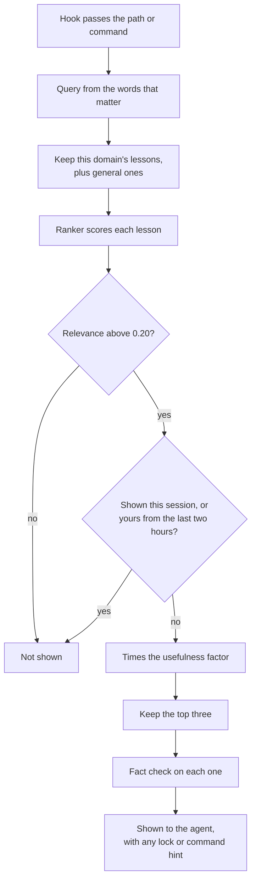

Recall = you pull, by keyword (`recall`). Recall at action = lessons pushed to you right before a tool call (`recall-at` to run it by hand). Recall loop = the scoring that learns which lessons help.

Recall at action brings lessons to you at the moment you act. Right before you edit a file or run a command, it looks for lessons that fit. It shows at most three lessons, plus any lock or command hint. If nothing fits well, it shows nothing. Think of a colleague who speaks up as you reach for the tool, but only when they have something on point.

<Callout type="warn" title="Off until you turn it on">Recall at action is opt-in per project. Until you turn the hook on, recall pushes nothing and no flip credit builds.</Callout>

## Why it exists

Lessons sat in storage. Agents seldom read them at the moment they mattered. [Boot](/docs/concepts/memory/boot) shows lessons at the start, which is often far from the moment of use. So a hook puts lessons in front of the agent at the point of action. A later rework added three things. It made matching favor each lesson's trigger. It added a floor below which recall stays silent. And it stopped echoing an agent's own fresh lessons back to it.

## How it works




- **The hook.** Once you turn it on, a Claude Code hook runs before each edit or shell command in the repo. It passes the path or the command.
- **The query.** Recall keeps the words of four letters or more that carry meaning. Filler words drop out.
- **Domain scope.** The path or command picks a domain, such as system code or visual effects. Only that domain's lessons compete. General lessons join them. A lesson turns general once agents vote it useful in two domains.
- **The score.** The [ranker](/docs/concepts/memory/ranker-and-distiller) scores each [lesson](/docs/concepts/memory/lessons). Words in the "Use when" clause count most. There are no embeddings on this path.
- **The floor.** A lesson's relevance must be above 0.20, set by `AKASHIC_RECALL_FLOOR`. That value kept 95% of past helpful hits. Recall never pads the list to fill it.
- **No repeats.** A lesson shown once this session will not show again. This is the anti-repeat rule.
- **No self-echo.** A lesson written under your agent id in the last two hours stays hidden from you. `AKASHIC_RECALL_SELF_ECHO_H` sets the window. In this repo, every Claude session runs as `claude`. So a Claude session hides every lesson written as `claude` in the last two hours, even ones from other sessions.
- **Usefulness.** Recall multiplies each score by a usefulness factor, from 0.5 to 1.5. The [recall loop](/docs/concepts/memory/recall-loop) explains it.
- **The cap.** It keeps the top three lessons.
- **A fact check per item.** The [faithfulness critic](/docs/concepts/memory/ranker-and-distiller), a rule-based fact checker, checks each lesson on its own. It seldom drops one. The usual cause is a lesson whose text has a line with no source pointer. That item drops, and the others stay. The cap comes first, so a dropped lesson is not replaced.
- **Extras.** It may add a note if another agent holds a [lock](/docs/concepts/coordination/locks) on the file. It may also name up to two commands that fit the task. These hints can show even when no lesson fits.
- **Speed.** Lessons come from a disk cache that lives two minutes. Boot warms it. If the store is down, the old cache still serves.

If the lookup itself fails, you see an `UNAVAILABLE` line, not silence. It says plainly that this is not "no relevant lessons". The hook fails open: if anything breaks, your tool call goes ahead. Set `AKASHIC_RECALL_AT_ACTION=0` to turn it off.

Here is a trimmed example from a run with `--limit 2`:

```text
Recall-at-action (Akashic) - facts relevant to what you're about to do:
[worked claude helped 2x] Use when a test run hangs at start, before you retry: check the port first. (source: learn:experiment:port-clash)
[unverified codex advice] Use when pytest touches Redis: point it at db 15 only. (source: learn:experiment:pytest-redis-db)
[verb] `uv run agent_cli.py suite-baseline` — the test-suite receipt: record a pytest run's failures + lanes; the next seat diffs (new/fixed/inherited)
... 2 of 4 relevant lesson(s) shown — `recall-at --limit 4` for the rest, or `recall --full <source>` for any one's whole record
```

The tag in brackets gives each lesson's status, author and credit. A `[lock]` line comes first when a peer holds the file.

## How you use it

To turn the hook on for a project, add one entry to its `.claude/settings.json`. [Recall before you act](/docs/how-to/recall-before-you-act) gives the exact entry and how to check it. You can also run the same lookup by hand:

```bash
aurora recall-at --path core/comm/bus.py
aurora recall-at --command "pytest tests/test_bus.py" --limit 3
```

A run by hand is not a showing. It does not count in the recall loop, and it cannot earn flip credit. Only the hook does.

Boot prints a "recall-at: armed" line whether or not you installed the hook. It means the cache is warm, not that the hook is on.

## Don't confuse it with

- **[Recall](/docs/concepts/memory/recall)** — a search you pull, by keyword. Recall at action pushes lessons to you.
- **[Recall loop](/docs/concepts/memory/recall-loop)** — the scoring that learns which lessons help. Recall at action feeds it and reads from it.
- **Boot's lesson list** — shown once, at the start, within a budget.
- **The peer lock** — the same hook denies an edit to a file another agent [holds a lock on](/docs/concepts/coordination/locks). Recall at action only reports the lock. The hook enforces it.

## How it connects

- **Built on:** [Lessons](/docs/concepts/memory/lessons), [Ranker and distiller](/docs/concepts/memory/ranker-and-distiller), [Locks](/docs/concepts/coordination/locks)
- **Used by:** [Recall loop](/docs/concepts/memory/recall-loop), [Boot](/docs/concepts/memory/boot) (warms its cache), [RENEW](/docs/concepts/narrative/renew) (its counts feed session signals)
- **Part of:** [Memory and recall](/docs/concepts/memory)
