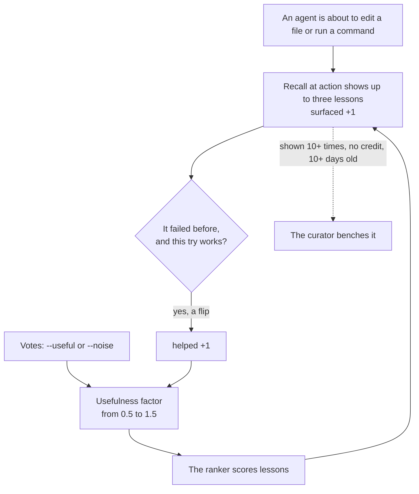

The recall loop checks whether the lessons we show do any good. Each lesson keeps a scorecard: how often it showed up, and how often it helped. Lessons that help rank higher. Lessons that never help move to a back shelf, and they can come back.

<Callout type="warn" title="The curator runs by hand">Nothing benches a lesson on a schedule; the curator stamps only when someone runs `recall-curate --apply`.</Callout>

## Why it exists

Without feedback, the ranking cannot learn what matters. One week of data showed the cost. Of 60 lessons, 34 had shown up five times or more and never helped once. More than half the lessons on view cost space and gave nothing back. Later the team found a second flaw. The headline "value rate" measured how much feedback existed, not how good the lessons were. Over 95% of the times a lesson showed up, no one ever voted on it. Now boot's pulse says how many showings got a vote at all, and what share of those votes said useful.

## How it works




- **Impression.** Each time [recall at action](/docs/concepts/memory/recall-at-action) shows a lesson, its `surfaced` count goes up by one.
- **Flip credit** (also called outcome credit). Say a command fails. A lesson shows up. The next try works. That is a flip, from fail to success. Each lesson shown for that target gets `helped` plus one. A first-try success credits nothing. The loop needs a before and an after. A flip also nudges the agent to record a new lesson.
- **Votes.** `recall-feedback` lets an agent mark a lesson `--useful` or `--noise`. Each lesson belongs to one area, such as system code or visual effects. If agents vote a lesson useful in two areas, using `--domain`, it starts to show everywhere.
- **Interest.** Pulling the full record with `recall --full` counts as `engaged`. That shields a lesson from the bench, but it does not raise its rank.
- **Usefulness factor.** These counts become one multiplier. An unseen lesson sits near 1.0. A proven lesson climbs toward 1.5. Noise falls toward 0.5.
- **Funnel.** A read-only report follows lessons from shown, to helped, to flips, to new lessons captured. Boot prints a one-line pulse of it.
- **Curator.** It benches a lesson that showed up 10 times or more, earned no credit, and is at least 10 days old. A benched lesson stops showing at the moment of action, but it keeps its history. A later `--apply` run lifts the bench if the lesson earns credit. Once a lesson has sat on the bench for 14 days, it can get another chance to show. At most three do at a time, oldest first.
- **Dissent.** It looks for a lesson that argues against the top one, through a "contradicts" link. Lessons cannot carry that link today, so dissent never speaks. The code exists; nothing feeds it.

## How you use it

```bash
aurora recall-feedback --source learn:experiment:port-clash --useful
aurora stats
aurora recall-curate            # report only
aurora recall-curate --apply    # stamp the bench
```

## Don't confuse it with

- **The `bench` verb** — parks stale requests in an inbox. It has nothing to do with benched lessons.
- **Graduate** — retires a lesson because automation now enforces its rule. Benching retires a lesson because it never helped.
- **Repeat** — `learn --repeat-of` records that someone broke a known lesson again.

## How it connects

- **Built on:** [Recall at action](/docs/concepts/memory/recall-at-action), [Lessons](/docs/concepts/memory/lessons), [Store](/docs/concepts/foundations/store)
- **Used by:** [Recall at action](/docs/concepts/memory/recall-at-action) (its ranking, which closes the loop), [Boot](/docs/concepts/memory/boot) (funnel pulse)
- **Part of:** [Memory and recall](/docs/concepts/memory)
