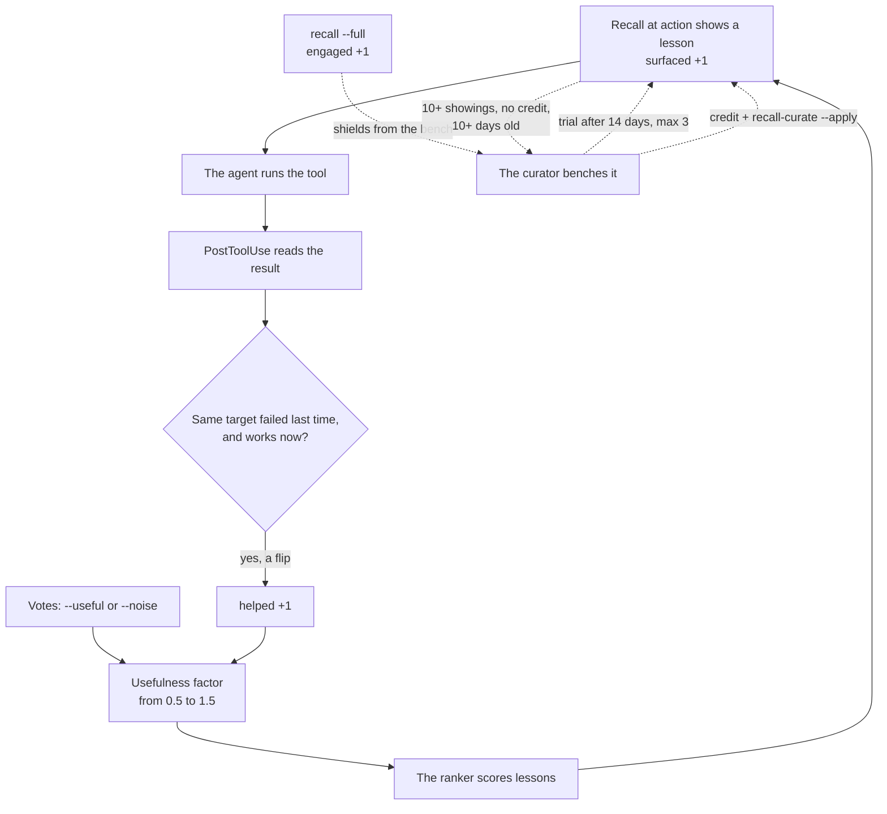

Recall = you pull, by keyword (`recall`). Recall at action = lessons pushed to you right before a tool call (`recall-at` to run it by hand). Recall loop = the scoring that learns which lessons help.

The recall loop checks whether the lessons we show do any good. Each lesson keeps a scorecard: how often it showed up, and how often it helped. Lessons that help rank higher. Lessons that never help move to a back shelf, and they can come back.

<Callout type="warn" title="The curator runs by hand">Nothing benches a lesson on a schedule; the curator stamps only when someone runs `recall-curate --apply`.</Callout>

## Why it exists

Without feedback, the ranking cannot learn what matters. One week of data showed the cost. Of 60 lessons, 34 had shown up five times or more and never helped once. More than half the lessons on view cost space and gave nothing back. Later the team found a second flaw. The headline "value rate" measured how much feedback existed, not how good the lessons were. Over 95% of the times a lesson showed up, no one ever voted on it. Now boot's pulse says how many showings got a vote at all, and what share of those votes said useful.

## How it works




- **Impression.** Each time the hook for [recall at action](/docs/concepts/memory/recall-at-action) shows a lesson, its `surfaced` count goes up by one. Plan-time recall, a separate opt-in hook on each new prompt, adds to `surfaced` too. A run of `recall-at` by hand never counts.
- **Flip credit**. A lesson shows up for a target this session. Later that exact target fails and then succeeds. That is a flip, from fail to success. Every lesson shown for that target then gets `helped` plus one.
- **What "the same target" means.** For a command, it is the text lowercased with spaces collapsed. For a file, it is the absolute path. A retry with a slightly different command is a new target, so it is no flip. A first-try success credits nothing.
- **Both hooks.** Credit needs the PreToolUse hook to show the lesson and the PostToolUse hook to judge the result. A flip also nudges the agent to record a new lesson.
- **Votes.** `recall-feedback` lets an agent mark a lesson `--useful` or `--noise`. Each lesson belongs to one area, such as system code or visual effects. If agents vote a lesson useful in two areas, using `--domain`, it starts to show everywhere.
- **Interest.** Pulling the full record with `recall --full` counts as `engaged`. That shields a lesson from the bench, but it does not raise its rank.
- **Credit.** Credit means `helped` plus `useful` plus `engaged`. The curator reads this sum.
- **Funnel.** A read-only report follows lessons from shown, to helped, to flips, to new lessons captured. Boot prints a one-line pulse of it.

### The usefulness factor

The counts become one multiplier on each lesson's score. A few real values:

| Track record | Factor |
| --- | --- |
| Never shown | about 1.0 |
| Shown 10 times, no credit | about 0.58 |
| Shown 3 times, helped all 3 | about 1.30 |
| Many noise votes | down to 0.5 |

The top of 1.5 is a ceiling that the formula never reaches. Recall reads the counts when it builds the lesson cache. So a vote changes the ranking only after the cache refreshes, up to 120 seconds later.

### The curator and the bench

- **Bench.** The curator benches a lesson that showed up 10 times or more, earned no credit, and is at least 10 days old. The code fixes those two numbers; no setting changes them. A benched lesson stops showing at the moment of action. It keeps its history. Plain recall still lists it with a `[benched]` tag. Boot does not read the stamp, so it can still show there, untagged, ranked lower by its low credit.
- **Back from the bench.** When a benched lesson has credit, the next `recall-curate --apply` lifts the bench.
- **Bench probe.** After 14 days on the bench, a lesson may get a trial slot at the moment of action. At most three are on trial at once, oldest first. A trial lesson carries a `probation` tag. Today the same three oldest benched lessons keep the trial slots until they earn credit; nothing rotates them. Two settings tune the trial: `AKASHIC_BENCH_PROBE_DAYS` and `AKASHIC_BENCH_PROBE_MAX`. See [memory settings](/docs/reference/memory-settings).
- **What `--apply` does.** It benches lessons and lifts benches. It also prunes counters for lessons that no longer exist, and applies pending lesson-edit stamps. The `wrap` command nudges you to run it when there is work to do.
- **Dissent.** It looks for a lesson that argues against the top one, through a "contradicts" link. Lessons cannot carry that link today, so dissent never speaks. The code exists; nothing feeds it.

<Callout title="In other agent tools">

| Their term | Where | What it means there |
| --- | --- | --- |
| Memory retention and validation | [GitHub Copilot](https://docs.github.com/en/copilot/concepts/agents/copilot-memory#retention-and-validation) | Memories expire after 28 days unused and are checked against current code before use. |
| Optimizing skill descriptions | [Agent Skills](https://agentskills.io/skill-creation/optimizing-descriptions) | Testing and rewriting a skill's description so it triggers on the right requests. |
| Evaluating skill output quality | [Agent Skills](https://agentskills.io/skill-creation/evaluating-skills) | Running test cases with and without a skill and grading results to improve it. |

**How Aurora differs:** Copilot drops a memory that sits unused. Aurora benches a lesson that shows up often and never helps. Credit comes from flips, when a failed try works after a lesson shows up.

</Callout>

## How you use it

```bash
aurora recall-feedback --source learn:experiment:port-clash --useful
aurora stats
aurora recall-curate            # report only
aurora recall-curate --apply    # stamp the bench
```

<Callout title="In other agent tools">

| Their term | Where | What it means there |
| --- | --- | --- |
| /stats | [Gemini CLI](https://geminicli.com/docs/reference/commands/#stats) | Not the same: shows usage for the current session, such as tokens, tool calls and quota. |
| Stats | [OpenCode](https://opencode.ai/docs/cli#stats) | Not the same: shows token use and cost across your sessions. |

**How Aurora differs:** `aurora stats` reports the recall funnel. It counts lessons shown, lessons that helped, flips and new lessons. It does not track tokens.

</Callout>

## Don't confuse it with

- **[Recall](/docs/concepts/memory/recall)** — a keyword search you pull. Its results do not add showings.
- **[Recall at action](/docs/concepts/memory/recall-at-action)** — the hook that shows lessons before a tool call. The loop scores what it shows.
- **The `bench` verb** — parks stale requests in an inbox. It has nothing to do with benched lessons.
- **Graduate** — retires a lesson because automation now enforces its rule. Benching retires a lesson because it never helped.
- **Repeat** — `learn --repeat-of` records that someone broke a known lesson again.

## How it connects

- **Built on:** [Recall at action](/docs/concepts/memory/recall-at-action), [Lessons](/docs/concepts/memory/lessons), [Store](/docs/concepts/foundations/store)
- **Used by:** [Recall at action](/docs/concepts/memory/recall-at-action) (its ranking, which closes the loop), [Boot](/docs/concepts/memory/boot) (funnel pulse)
- **Part of:** [Memory and recall](/docs/concepts/memory)
