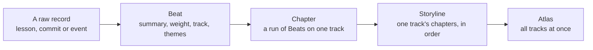

The narrative spine is Aurora's story of its own work. Small events, called Beats, group into chapters. Each project thread, called a track, gets its own run of chapters. You can read the whole story at a glance, or zoom down to one raw record.

Think of a book series. Beats are sentences. Chapters are chapters. Tracks are the books. Themes are index entries that cut across all the books. The Atlas is the series overview.

## Why it exists

The [ledger](/docs/concepts/foundations/ledger) records everything, but it only answers "what rows exist?" An agent needs "what mattered, and when?" It needs a summary first, with a way to drill back to the raw record. The spine gives that view. It comes from the ledger and never replaces it.

## How it works




- **Beat.** One event at one time. It has a short summary, a weight, a track, some themes, typed links, and a pointer to the raw record it came from. That record might be a lesson, a commit or an event.
- **Weight.** How much a Beat matters, from 0 to 5. Each kind has a default. A milestone or a `mark` is 5. A decision, lesson or handoff is 4. A blocker is 3, a commit 2, a note 1.
- **Track.** The project thread a Beat belongs to. The TrackRouter picks one with plain rules, no model. It tries the strongest clue first: the files a commit touched. Then it tries strong keywords, then the category, then weak keywords. With no clue, it keeps the active track.
- **Theme.** An idea that cuts across tracks. One Beat can carry many themes. Themes come from keywords. Theming by embeddings exists but is off by default.
- **Chapter.** A run of Beats on one track. The Chronicler, the process that turns Beats into chapters, starts a new one at three points. A `mark` starts one. So does any weight-5 Beat, such as a milestone. So does a gap of four hours or more. The [ranker and distiller](/docs/concepts/memory/ranker-and-distiller) write each chapter's summary.
- **Storyline and Atlas.** A storyline is each track's chapters, in time order. The Chronicler rebuilds it on every render. The Atlas is the overview across all tracks.

So the story has three axes: time (when), track (which project) and theme (which idea). Every link between Beats uses one of the [relationship types](/docs/concepts/foundations/relationship-types).

Chapters keep stable ids. A rerun on the same Beats rebuilds the same chapter in place. A real correction does not edit the old chapter. A new one [supersedes](/docs/concepts/foundations/append-only-record) it.

<Callout type="warn" title="Built, not yet wired">A drift check, which warns when work wanders off its track, exists in code, but nothing calls it yet.</Callout>

<Callout title="In other agent tools">

| Their term | Where | What it means there |
| --- | --- | --- |
| Spaces | [Windsurf](https://docs.devin.ai/desktop/spaces) | Groups that hold all the sessions, PRs, files and context for one task or project. |
| Labels | [Pi](https://github.com/earendil-works/pi/blob/main/packages/coding-agent/docs/session-format.md#labelentry) | User bookmarks on a session entry, such as a named checkpoint. |
| Team State (task board, mailbox, mission log) | [Cline](https://docs.cline.bot/cli/agent-teams#team-state) | Each agent team keeps a task board, a mailbox and a log in a local database. |

**How Aurora differs:** Their tools group chats by project or mark a point in one. The spine builds a story from every record. It groups Beats into chapters, one track per project.

</Callout>

## How you use it

```bash
aurora story                  # print the story
aurora story --mark "Ship v2" # start a new chapter with a title
aurora story --beat <id> --raw  # drill to the raw events under a Beat
aurora log decision --summary "Use SQLite for the index"
```

`learn` and `note` also write Beats. `uv run bootstrap.py --start-session` closes the last session's story and opens a new one. The rendered story lives in `chronicles/story.md`.

## Don't confuse it with

- **chronicle** — the curated highlights in `chronicles/`. Never call the raw event log a chronicle. The Chronicler is the process that writes them.
- **Track** — a story thread, not a git branch or a task.
- **Theme** — not a tag on a lesson, and not a recall domain.

<Callout title="In other agent tools">

| Their term | Where | What it means there |
| --- | --- | --- |
| Themes | [OpenCode](https://opencode.ai/docs/themes) · [Gemini CLI](https://geminicli.com/docs/cli/themes/#available-themes) | Not the same: color schemes for the app screen. |
| Threads | [Amp](https://ampcode.com/docs/threads) | Not the same: one conversation with the agent, with prompts, replies and changed files. |
| Thread | [Codex](https://learn.chatgpt.com/docs/app-server#threads) | Not the same: the stored object that holds one conversation and its turns. |
| /chronicle | [GitHub Copilot](https://docs.github.com/en/copilot/how-tos/copilot-cli/use-copilot-cli/chronicle#using-the-chronicle-slash-command) | Not the same: a command that answers questions and builds reports from past sessions. |

**How Aurora differs:** In Aurora, a theme is an idea that cuts across tracks. A track is the project thread. A chronicle is the curated highlights.

</Callout>

## How it connects

- **Built on:** [Ledger](/docs/concepts/foundations/ledger), [Store](/docs/concepts/foundations/store), [Relationship types](/docs/concepts/foundations/relationship-types), [Ranker and distiller](/docs/concepts/memory/ranker-and-distiller), [Signals](/docs/concepts/foundations/signals).
- **Used by:** [Episodes](/docs/concepts/narrative/episodes), [Tags](/docs/concepts/narrative/tags), [Perspectives](/docs/concepts/narrative/perspectives), [Boot](/docs/concepts/memory/boot), [Chronicles](/docs/concepts/memory/chronicles).
